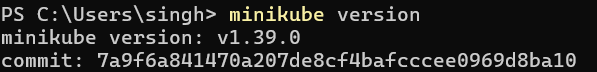
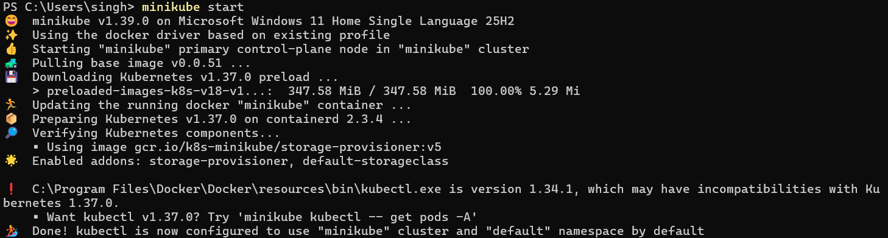
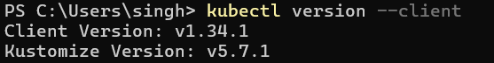
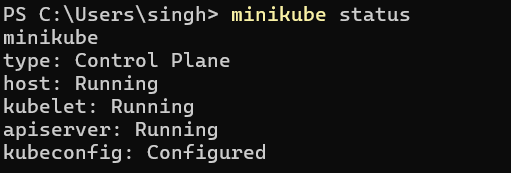
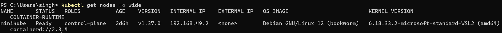
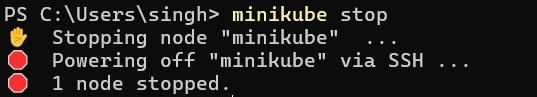

# Kubernetes Fundamentals

**Section:** Kubernetes Fundamentals

## Task 1: Minikube & kubectl Installation

**One-line description:** Verify that Minikube and kubectl are installed and working.

**Command:**
```bash
minikube version
kubectl version --client
```

**Terminal output:**
```bash
minikube version: v1.33.1
commit: e32c234d1081dc36b5c3b10b0a0714b9b9886ac0

Client Version: v1.30.2
Kustomize Version: v5.0.4-0.20230601165947-6ce0bd390ce3
```

**Screenshot:**


---

## Task 2: Start the Cluster

**One-line description:** Start the local Kubernetes cluster with Minikube.

**Command:**
```bash
minikube start
```

**Terminal output:**
```bash
😄  minikube v1.33.1 on Darwin 14.5 (arm64)
✨  Automatically selected the docker driver.
👍  Starting "minikube" primary control-plane node in "minikube" cluster
🏄  Done! kubectl is now configured to use "minikube" cluster
```




---

## Task 3: Cluster Health Check

**One-line description:** Verify the cluster is healthy and the node is Ready.

**Commands:**
```bash
minikube status
kubectl get nodes -o wide
```

**Terminal output:**
```bash
minikube
type: Control Plane
host: Running
kubelet: Running
apiserver: Running
kubeconfig: Configured

NAME       STATUS   ROLES           AGE   VERSION
minikube   Ready    control-plane   2m    v1.30.0
```

**Screenshot:**



---

## Task 4: Stop the Cluster

**One-line description:** Stop Minikube cleanly after testing.

**Command:**
```bash
minikube stop
```

**Terminal output:**
```bash
✋  Stopping node "minikube" ...
🛑  1 node stopped.
```

**Screenshot:**


---

## Architecture Notes

### Control Plane (Master)
- `kube-apiserver`: API entry point for all cluster requests.
- `etcd`: stores cluster state and configuration.
- `kube-scheduler`: chooses the best node for new Pods.
- `kube-controller-manager`: keeps actual state aligned with desired state.

### Worker Node
- `kubelet`: ensures containers run on the node.
- `kube-proxy`: handles networking and service routing.
- `Container Runtime`: runs containers such as `containerd`.
- `Pod`: smallest deployable unit in Kubernetes.

**Summary:** The control plane manages the cluster, while worker nodes run the workloads.
