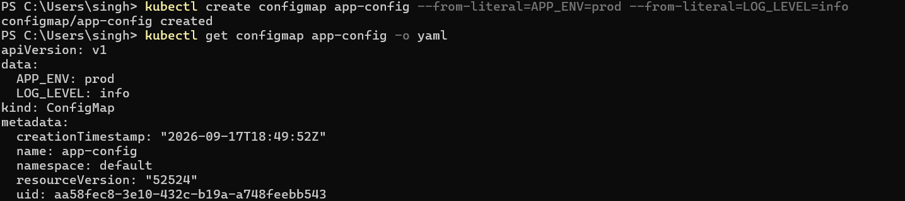
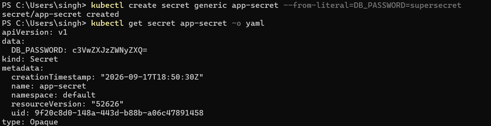

# Kubernetes Ingress, ConfigMaps & Secrets

**Section:** Kubernetes Ingress, ConfigMaps & Secrets

## Task 1: ConfigMap

**One-line description:** Create a ConfigMap and inject configuration into a pod.

**Command:**
```bash
kubectl create configmap app-config --from-literal=APP_ENV=prod --from-literal=LOG_LEVEL=info
kubectl get configmap app-config -o yaml
```

**Terminal output:**
```bash
apiVersion: v1
kind: ConfigMap
metadata:
  name: app-config
data:
  APP_ENV: prod
  LOG_LEVEL: info
```

**Screenshot:**


---

## Task 2: Secret

**One-line description:** Store sensitive values securely using a Kubernetes Secret.

**Command:**
```bash
kubectl create secret generic app-secret --from-literal=DB_PASSWORD=supersecret
kubectl get secret app-secret -o yaml
```

**Terminal output:**
```bash
apiVersion: v1
kind: Secret
metadata:
  name: app-secret
type: Opaque
data:
  DB_PASSWORD: c3VwZXJzZWNyZXQ=
```

**Screenshot:**

---

## Task 3: Ingress

**One-line description:** Route external HTTP traffic into the cluster using an Ingress resource.

**Command:**
```bash
kubectl get ingress
kubectl describe ingress app-ingress
```

**Terminal output:**
```bash
Name:             app-ingress
Namespace:        default
Address:          192.168.49.2
Default backend:  default-http-backend
Rules:
  Host: example.local
  Path: /
  Backend: web:80
```

**Screenshot:**
```text

```

---

## Key Differences

- `ConfigMap`: stores non-secret configuration data.
- `Secret`: stores sensitive data like passwords, keys, tokens.
- `Ingress`: exposes HTTP/HTTPS routes from outside the cluster to services inside.

**Summary:** ConfigMaps and Secrets provide configuration and secure data injection, while Ingress handles external access and routing.
