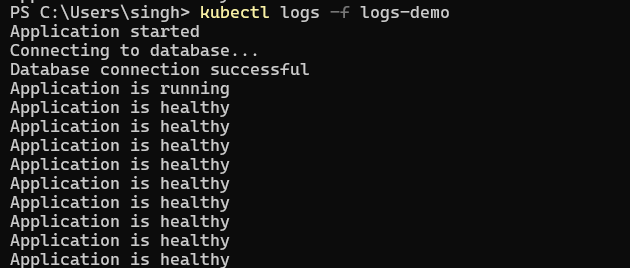
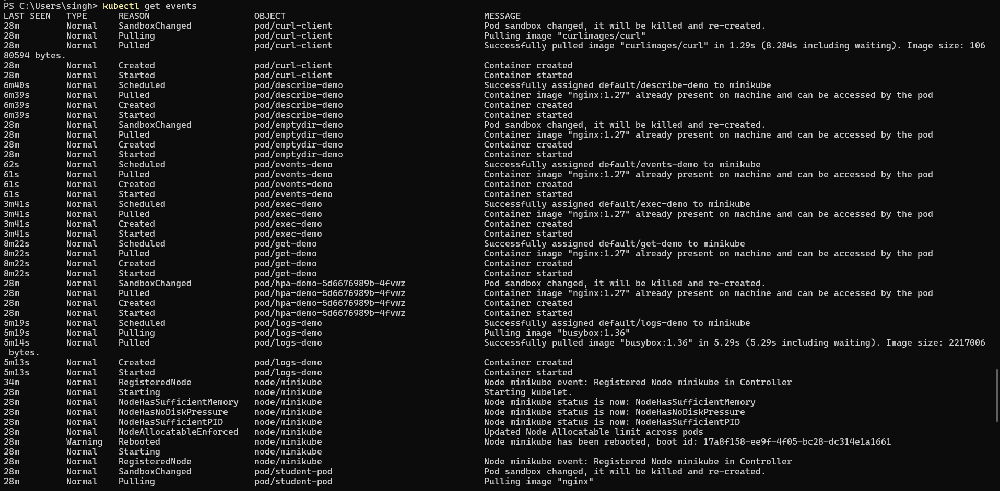
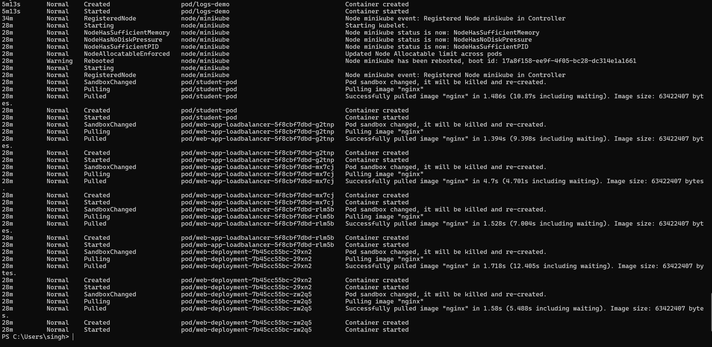

# Logs and Events

This section is for capturing screenshots of the following Kubernetes commands.

## 1) kubectl logs -f logs-demo

---

## 2) kubectl get events

---

> Replace the placeholder image paths above with your actual screenshot files after taking the screenshots.
