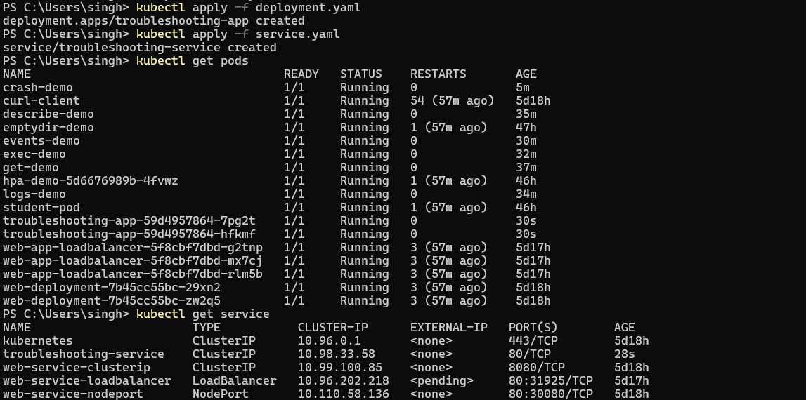
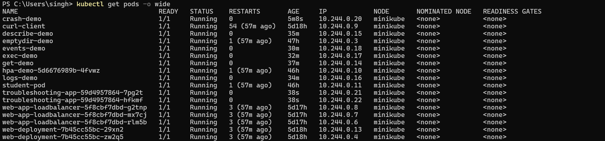
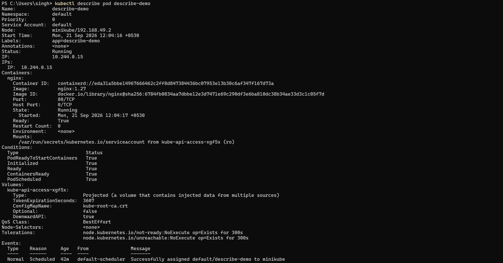
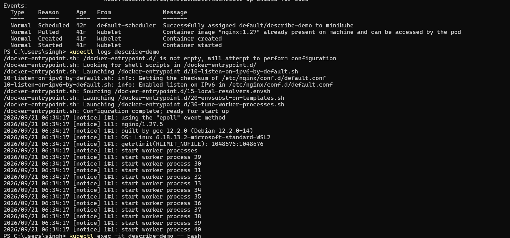
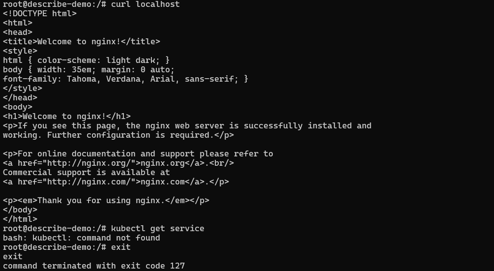
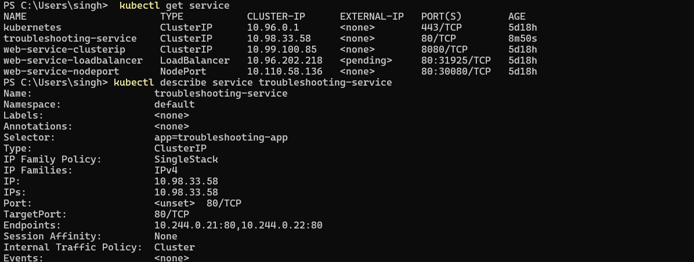
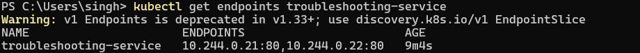
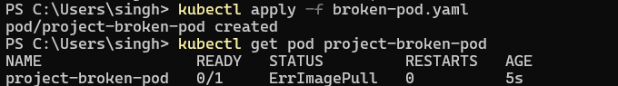
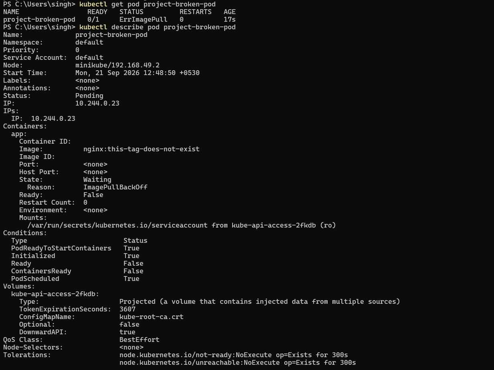

# Kubernetes Troubleshooting Challenge

Your job is to:

```text
Deploy
  │
  ▼
Observe
  │
  ▼
Break
  │
  ▼
Investigate
  │
  ▼
Find root cause
  │
  ▼
Fix
  │
  ▼
Verify
```

---

## Project Scenario

You have a simple Nginx application running inside Kubernetes.

You have:

- Deployment
- Service
- Pods

Your application should be accessible through the Service. But your team has reported that something is wrong.

Your job is to find and fix the problems.

---

## 1. Deploy The Application

Run:

```bash
kubectl apply -f deployment.yaml
kubectl apply -f service.yaml
```

Check:

```bash
kubectl get pods
kubectl get service
```



---

## 2. Check The Application

Run:

```bash
kubectl get pods -o wide
```

Then:

```bash
kubectl describe pod <pod-name>
```

Then:

```bash
kubectl logs <pod-name>
```

Then:

```bash
kubectl exec -it <pod-name> -- bash
```

Inside the container:

```bash
curl localhost
```

You should get the Nginx response.





---

## 3. Check The Service

Run:

```bash
kubectl get service
```

Then:

```bash
kubectl describe service troubleshooting-service
```

Check:

- Selector
- TargetPort
- Endpoints



## 4. Check Endpoints

Run:

```bash
kubectl get endpoints troubleshooting-service
```

You should see Pod IP addresses.



---

## 5. Create A Broken Pod

Run:

```bash
kubectl apply -f broken-pod.yaml
```

Check:

```bash
kubectl get pod project-broken-pod
```

You should see an image-related problem.


---

## 6. Troubleshoot It

You are NOT allowed to immediately change the YAML.

First run:

```bash
kubectl get pod project-broken-pod
```

Then:

```bash
kubectl describe pod project-broken-pod
```

Then look at Events. Find the root cause.



---
