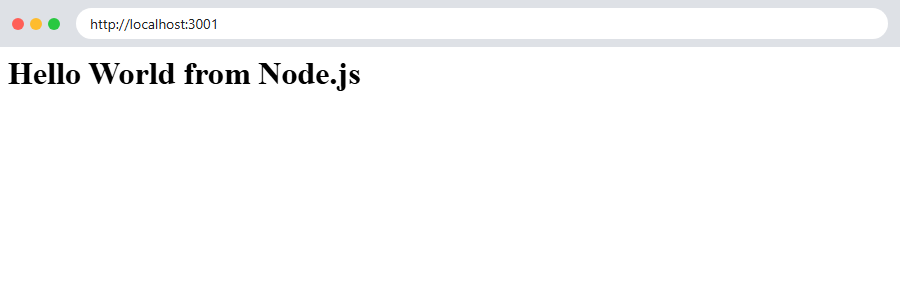
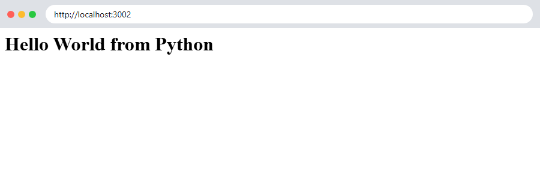
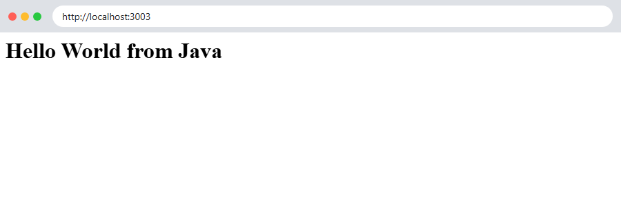
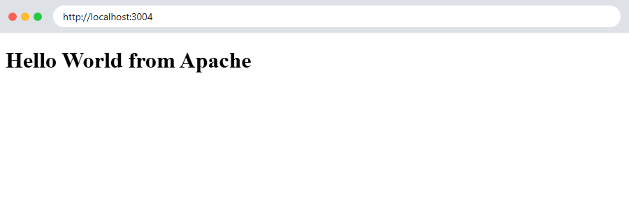
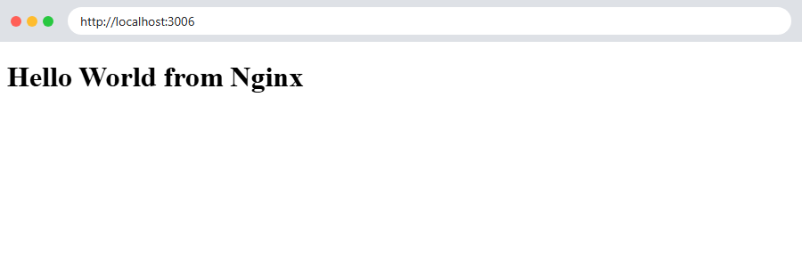

# Session 06: Docker Fundamentals: Hello World Applications

**Name:** Siddhant Singh
**Roll number:** 24BCS10153

Six simple **Hello World** web applications, each in its own folder with its own code and `Dockerfile`:

| Folder | Base image | Container port | Host port |
| --- | --- | --- | --- |
| [nodejs-app](nodejs-app/) | `node:22-alpine` | 3000 | 3001 |
| [python-app](python-app/) | `python:3.13-alpine` | 8000 | 3002 |
| [java-app](java-app/) | `eclipse-temurin:21-jdk-alpine` | 8080 | 3003 |
| [Apache-app](Apache-app/) | `httpd:2.4-alpine` | 80 | 3004 |
| [React-app](React-app/) | `node:22-alpine` (build) → `nginx:1.27-alpine` | 80 | 3005 |
| [nginx-app](nginx-app/) | `nginx:1.27-alpine` | 80 | 3006 |

---

## Step 1: Build the images

```bash
$ docker build -q -t devops-nodejs ./nodejs-app
sha256:8eed2a441b9ac2950757fab269c837925542c5538c45aa0f234456d3c91868b7
$ docker build -q -t devops-python ./python-app
sha256:d3c6a56b029687f105fca87579041dd1b51676272fb98dbf55159bd5a1ff78b1
$ docker build -q -t devops-java ./java-app
sha256:f0e63cf24e063387e6dbec63b4b40b2556252bd0a4d67bbbe53666c068511014
$ docker build -q -t devops-apache ./Apache-app
sha256:beed9f697d121deecec563d365dee78e9afe54b6fce689d9c080fe5903e7fbb3
$ docker build -q -t devops-react ./React-app
2026/10/07 19:52:49 http2: server: error reading preface from client //./pipe/dockerDesktopLinuxEngine: file has already been closed
sha256:1fca16be461eab086d2187ef1a0c6d56577477498322a119b6ab57cf56aecca0
$ docker build -q -t devops-nginx ./nginx-app
2026/10/07 19:52:53 http2: server: error reading preface from client //./pipe/dockerDesktopLinuxEngine: file has already been closed
sha256:1b0f4f8e135b21140d81496a34fdc0f769fa3f3c5c17be8dc2827defe3ec3c2c
$ docker images --format "table {{.Repository}}\t{{.Tag}}\t{{.Size}}" | grep -E "REPOSITORY|devops-"
REPOSITORY                    TAG         SIZE
devops-nginx                  latest      73.6MB
devops-react                  latest      73.9MB
devops-apache                 latest      105MB
devops-java                   latest      552MB
devops-python                 latest      78.7MB
devops-nodejs                 latest      238MB
```

Each build printed the new image ID. `docker images` lists all six images. The Java image is the largest because it contains a full JDK, and the React image is small because the multi-stage build keeps only Nginx and the built files.

---

## Step 2: Run the containers

```bash
$ docker run -d --name nodejs-app -p 3001:3000 devops-nodejs
28af19f306158aac114eae496dd295f8460d15f8cce0cac35c84f767a9312d7e
$ docker run -d --name python-app -p 3002:8000 devops-python
3ad8d6748f2c7ca325899c4a9ba8bb358491739f50770e067790d5256bcc470f
$ docker run -d --name java-app -p 3003:8080 devops-java
69c0dd7bf7805963c0c7446d4825b0234a705692c901a512e73a1d220b3ec13e
$ docker run -d --name apache-app -p 3004:80 devops-apache
1a3b4a434a5109e683e6daefb71745fb31f228020da86aaed8226805e47ae757
$ docker run -d --name react-app -p 3005:80 devops-react
a61116d9ea9cbc53b78d8d4dc32305d83865d591438de7b5654be0d14ae30556
$ docker run -d --name nginx-app -p 3006:80 devops-nginx
6b230f99ae47fb10acc0bf41a4e3902b3940fd6a2272f1308fc9782ceb72556b
$ docker ps --format "table {{.Names}}\t{{.Image}}\t{{.Status}}\t{{.Ports}}" | grep -E "NAMES|devops-"
NAMES                IMAGE                                 STATUS                    PORTS
nginx-app            devops-nginx                          Up 4 seconds              0.0.0.0:3006->80/tcp, [::]:3006->80/tcp
react-app            devops-react                          Up 6 seconds              0.0.0.0:3005->80/tcp, [::]:3005->80/tcp
apache-app           devops-apache                         Up 7 seconds              0.0.0.0:3004->80/tcp, [::]:3004->80/tcp
java-app             devops-java                           Up 8 seconds              0.0.0.0:3003->8080/tcp, [::]:3003->8080/tcp
python-app           devops-python                         Up 10 seconds             0.0.0.0:3002->8000/tcp, [::]:3002->8000/tcp
nodejs-app           devops-nodejs                         Up 11 seconds             0.0.0.0:3001->3000/tcp, [::]:3001->3000/tcp
```

`-d` runs a container in the background and `-p host:container` publishes the port. All six containers are `Up`.

---

## Step 3: Verify "Hello World"

```bash
$ curl -s http://localhost:3001; echo
<h1>Hello World from Node.js</h1>
$ curl -s http://localhost:3002; echo
<h1>Hello World from Python</h1>
$ curl -s http://localhost:3003; echo
<h1>Hello World from Java</h1>
$ curl -s http://localhost:3004; echo
<!doctype html>
<html><head><title>Apache Hello World</title></head><body><h1>Hello World from Apache</h1></body></html>
$ curl -s http://localhost:3005; echo
<script type="module" crossorigin src="/assets/index-Dk4tg-16.js"></script>
<div id="root"></div>
$ curl -s http://localhost:3006; echo
<!doctype html>
<html><head><title>Nginx Hello World</title></head><body><h1>Hello World from Nginx</h1></body></html>
$ docker logs nodejs-app

> devops-nodejs-hello-world@1.0.0 start
> node server.js

Node.js app listening on port 3000
$ docker logs java-app
Java app listening on port 8080
$ docker exec react-app sh -c "grep -o 'Hello World from React' /usr/share/nginx/html/assets/*.js"
Hello World from React
```

The React app renders in the browser using JavaScript, so `curl` only receives the HTML shell. The last command confirms that the built JS bundle contains `Hello World from React`, and the browser screenshot below shows it rendered.

### Browser screenshots

| App | Screenshot |
| --- | --- |
| Node.js: http://localhost:3001 |  |
| Python: http://localhost:3002 |  |
| Java: http://localhost:3003 |  |
| Apache: http://localhost:3004 |  |
| React: http://localhost:3005 |  |
| Nginx: http://localhost:3006 |  |

---

## What I learned

- A **Dockerfile** describes how to build an image: `FROM` sets the base image, `WORKDIR` and `COPY` add the code, `RUN` runs build steps, `EXPOSE` documents the port, and `CMD` sets the start command.
- `docker build -t name ./folder` builds an image from a folder (the build context).
- `docker run -d -p HOST:CONTAINER image` starts a container and maps a port on my machine to the app inside it.
- The React app uses a **multi-stage build**: Node.js builds the static files, and only the output is copied into a small Nginx image.
