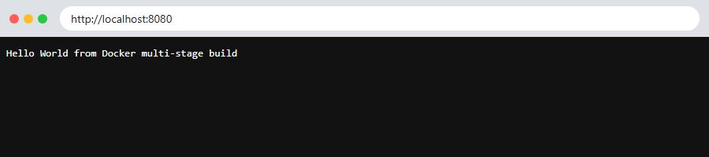

# Session 07: Dockerfiles & Images: Multi-Stage Build

## Task 2: Documentation

- **Name:** Siddhant Singh
- **Enrollment number:** 24BCS10153

---

## Task 1: Run the Multi-Stage Dockerfile

[Dockerfile](Dockerfile):

```dockerfile
FROM node:22-alpine AS dependencies
WORKDIR /app
COPY app/package.json ./package.json
# mkdir: npm does not create node_modules when there are no dependencies
RUN npm install --omit=dev && mkdir -p node_modules

FROM node:22-alpine AS runtime
WORKDIR /app
COPY --from=dependencies /app/node_modules ./node_modules
COPY app/server.js ./server.js
EXPOSE 8080
CMD ["node", "server.js"]
```

**How it works:** Stage 1 (`dependencies`) installs only the production packages. Stage 2 (`runtime`) starts again from a clean image and copies in just `node_modules` (with `COPY --from=dependencies`) and the app code. Build tools, the npm cache and other leftovers from stage 1 are not included in the final image.

> **Bug found and fixed:** The first build failed with `"/app/node_modules": not found`. This app has no dependencies, so `npm install` never created the `node_modules` folder, and stage 2 had nothing to copy. Adding `mkdir -p node_modules` fixed it.

### Build → Run → Verify

```bash
$ docker build --no-cache -t docker-multistage-hello . 2>&1 | grep -E "\[(dependencies|runtime) [0-9]/[0-9]\]|naming to" | awk '!seen[$0]++'
#5 [dependencies 1/4] FROM docker.io/library/node:22-alpine@sha256:0a7108bf6c7bf5de370ffb1a3ed6be93d405b43ff159f681a8d18c0e2bc2e402
#6 [dependencies 2/4] WORKDIR /app
#7 [dependencies 3/4] COPY app/package.json ./package.json
#8 [dependencies 4/4] RUN npm install --omit=dev && mkdir -p node_modules
#9 [runtime 3/4] COPY --from=dependencies /app/node_modules ./node_modules
#10 [runtime 4/4] COPY app/server.js ./server.js
#11 naming to docker.io/library/docker-multistage-hello:latest done
$ docker images docker-multistage-hello --format "table {{.Repository}}\t{{.Tag}}\t{{.Size}}"
REPOSITORY                TAG       SIZE
docker-multistage-hello   latest    238MB
$ docker run -d --name docker-multistage -p 8080:8080 docker-multistage-hello
d641f4e7ab66f95ed5c741d60e6add7c3e4cce24b872d89e33d6173778945c92
$ curl -s http://localhost:8080
Hello World from Docker multi-stage build
$ docker ps --filter name=docker-multistage
CONTAINER ID   IMAGE                     COMMAND                  CREATED         STATUS         PORTS                                         NAMES
d641f4e7ab66   docker-multistage-hello   "docker-entrypoint.s…"   6 seconds ago   Up 4 seconds   0.0.0.0:8080->8080/tcp, [::]:8080->8080/tcp   docker-multistage
$ docker port docker-multistage
8080/tcp -> 0.0.0.0:8080
8080/tcp -> [::]:8080
$ docker logs docker-multistage
Listening on port 8080
```

### Application running successfully



### Verified

- The app responds with **`Hello World from Docker multi-stage build`**.
- `docker ps` shows the `docker-multistage` container `Up` with port **`0.0.0.0:8080->8080/tcp`**.
- `docker port` confirms the container's port 8080 is published on the host's port 8080.

---

## Task 3: Docker Application Deployment (3 application types)

I deployed the Node.js, Python and Java apps from [Session 06](../session-06-docker-fundamentals/) (their code and Dockerfiles are in that folder):

```bash
$ docker run -d --name task3-nodejs -p 4001:3000 devops-nodejs
38ee5761c8fc0ca80cf3ac36503e0c6c1b4909630d7801a7e6757b38125a3981
$ docker run -d --name task3-python -p 4002:8000 devops-python
e9c4d3adc4823f56536b0ecfd69ba7d0f26881612e7fe6e72ba95227fc87b58c
$ docker run -d --name task3-java -p 4003:8080 devops-java
fb0046c4c6260849051e3f094a46a95d77920c05d44048aa4ef7adc8d5717f65
$ docker ps --filter name=task3- --format "table {{.Names}}\t{{.Image}}\t{{.Status}}\t{{.Ports}}"
NAMES          IMAGE           STATUS         PORTS
task3-java     devops-java     Up 4 seconds   0.0.0.0:4003->8080/tcp, [::]:4003->8080/tcp
task3-python   devops-python   Up 6 seconds   0.0.0.0:4002->8000/tcp, [::]:4002->8000/tcp
task3-nodejs   devops-nodejs   Up 7 seconds   0.0.0.0:4001->3000/tcp, [::]:4001->3000/tcp
$ curl -s http://localhost:4001; echo
<h1>Hello World from Node.js</h1>
$ curl -s http://localhost:4002; echo
<h1>Hello World from Python</h1>
$ curl -s http://localhost:4003; echo
<h1>Hello World from Java</h1>
```

All three application types run in their own containers and respond over HTTP.
