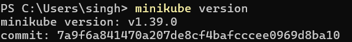
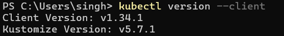
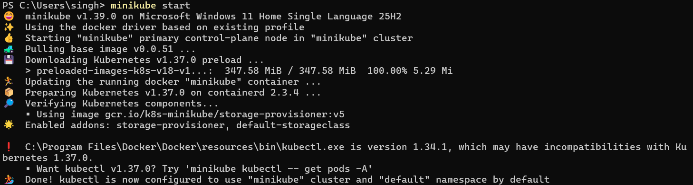
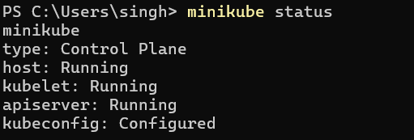
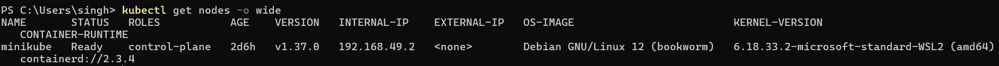
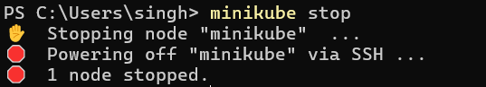

# Session 09: Kubernetes Fundamentals

**Name:** Siddhant Singh
**Roll number:** 24BCS10153

Environment: Windows 11, Docker Desktop, **Minikube v1.39.0** (docker driver), **kubectl v1.34.1**, Kubernetes **v1.37.0**.

---

## Task 1: Install and configure Minikube

Minikube runs a single-node Kubernetes cluster locally inside a Docker container. `kubectl` is the command-line tool used to talk to the cluster.

```bash
minikube version
kubectl version --client
minikube start
```

| `minikube version` | `kubectl version --client` |
| --- | --- |
|  |  |



---

## Task 2: Verify Kubernetes cluster status

```bash
$ minikube version
minikube version: v1.39.0
commit: 7a9f6a841470a207de8cf4bafcccee0969d8ba10
$ kubectl version --client
Client Version: v1.34.1
Kustomize Version: v5.7.1
$ minikube status
minikube
type: Control Plane
host: Running
kubelet: Running
apiserver: Running
kubeconfig: Configured

$ kubectl cluster-info
Kubernetes control plane is running at https://127.0.0.1:57406
CoreDNS is running at https://127.0.0.1:57406/api/v1/namespaces/kube-system/services/kube-dns:dns/proxy

To further debug and diagnose cluster problems, use 'kubectl cluster-info dump'.
$ kubectl get nodes -o wide
NAME       STATUS   ROLES           AGE   VERSION   INTERNAL-IP    EXTERNAL-IP   OS-IMAGE                         KERNEL-VERSION                              CONTAINER-RUNTIME
minikube   Ready    control-plane   22d   v1.37.0   192.168.49.2   <none>        Debian GNU/Linux 12 (bookworm)   6.18.40.1-microsoft-standard-WSL2 (amd64)   containerd://2.3.4
$ kubectl get pods -n kube-system
NAME                               READY   STATUS    RESTARTS        AGE
coredns-559f6c778d-m8rmz           1/1     Running   61 (26m ago)    22d
etcd-minikube                      1/1     Running   16 (26m ago)    22d
kindnet-88vvb                      1/1     Running   5 (26m ago)     22d
kube-apiserver-minikube            1/1     Running   105 (26m ago)   22d
kube-controller-manager-minikube   1/1     Running   92 (26m ago)    22d
kube-proxy-8wt5r                   1/1     Running   5 (26m ago)     22d
kube-scheduler-minikube            1/1     Running   51 (26m ago)    22d
metrics-server-768f9f6999-nb5vg    1/1     Running   220 (26m ago)   18d
storage-provisioner                1/1     Running   180 (26m ago)   22d
```




**Observed:** All four components (host, kubelet, apiserver, kubeconfig) are running, and the `minikube` node is `Ready` with the `control-plane` role. Every control-plane component (`etcd`, `kube-apiserver`, `kube-scheduler`, `kube-controller-manager`), plus `coredns` and `kube-proxy`, runs as a pod in the `kube-system` namespace.

To stop the cluster when done:



---

## Task 3: Kubernetes Architecture (short notes)

```text
                 ┌──────────────────── Control Plane ────────────────────┐
  kubectl ─────► │ kube-apiserver ◄──► etcd                               │
                 │      ▲                                                 │
                 │      ├── kube-scheduler   (picks a node for new Pods)  │
                 │      └── kube-controller-manager (keeps desired state) │
                 └──────┬─────────────────────────────────────────────────┘
                        │
                 ┌──────▼───────────── Worker Node ──────────────────────┐
                 │ kubelet ──► container runtime (containerd) ──► Pods   │
                 │ kube-proxy (Service networking rules)                 │
                 └───────────────────────────────────────────────────────┘
```

### Control Plane (the "brain")

- **kube-apiserver:** The front door of the cluster. Every request from `kubectl`, controllers and nodes goes through it, and it validates and stores objects.
- **etcd:** A key-value database holding the whole cluster state (desired and current).
- **kube-scheduler:** Watches for Pods that have no node yet and picks the best node based on CPU and memory, taints and tolerations, and affinity.
- **kube-controller-manager:** Runs control loops (Deployment, ReplicaSet, Node and others) that keep the actual state equal to the desired state.

### Worker Node (where apps run)

- **kubelet:** The agent on each node. It receives Pod specs from the API server and makes sure those containers are running and healthy.
- **kube-proxy:** Maintains network rules so that Service IPs route traffic to the right Pods.
- **Container runtime** (`containerd` here): Pulls images and starts and stops containers.
- **Pod:** The smallest deployable unit. It holds one or more containers that share an IP address and storage.

### How a `kubectl create deployment` request flows

1. `kubectl` sends the Deployment to the **API server**, which saves it in **etcd**.
2. The **controller manager** sees the new Deployment and creates a ReplicaSet, which in turn creates Pod objects.
3. The **scheduler** assigns each Pod to a node.
4. The **kubelet** on that node asks **containerd** to pull the image and start the container.
5. **kube-proxy** makes the Pods reachable through a Service.

---

## Task 4: Basic Kubernetes objects and commands

| Object | Purpose |
| --- | --- |
| **Pod** | One or more containers running together |
| **ReplicaSet** | Keeps N identical Pods running |
| **Deployment** | Manages ReplicaSets and gives rolling updates and rollbacks |
| **Service** | A stable IP and DNS name that load-balances across Pods |
| **Namespace** | Logical isolation of resources inside one cluster |
| **ConfigMap / Secret** | Configuration and sensitive values for Pods |

```bash
$ kubectl api-resources --namespaced=true | head -12
NAME                        SHORTNAMES   APIVERSION                     NAMESPACED   KIND
bindings                                 v1                             true         Binding
configmaps                  cm           v1                             true         ConfigMap
endpoints                   ep           v1                             true         Endpoints
events                      ev           v1                             true         Event
limitranges                 limits       v1                             true         LimitRange
persistentvolumeclaims      pvc          v1                             true         PersistentVolumeClaim
pods                        po           v1                             true         Pod
podtemplates                             v1                             true         PodTemplate
replicationcontrollers      rc           v1                             true         ReplicationController
resourcequotas              quota        v1                             true         ResourceQuota
secrets                                  v1                             true         Secret
$ kubectl get namespaces
NAME              STATUS   AGE
default           Active   22d
ingress-nginx     Active   19d
kube-node-lease   Active   22d
kube-public       Active   22d
kube-system       Active   22d
```

---

## Task 5: Kubernetes Basics tutorial (hands-on)

These are the steps of the official [Kubernetes Basics](https://kubernetes.io/docs/tutorials/kubernetes-basics/) tutorial: **deploy → explore → expose → scale → update → roll back**.

```bash
$ kubectl create deployment kubernetes-bootcamp --image=docker.io/jocatalin/kubernetes-bootcamp:v1
deployment.apps/kubernetes-bootcamp created
$ kubectl rollout status deployment/kubernetes-bootcamp --timeout=180s
Waiting for deployment "kubernetes-bootcamp" rollout to finish: 0 of 1 updated replicas are available...
deployment "kubernetes-bootcamp" successfully rolled out
$ kubectl get deployments
NAME                  READY   UP-TO-DATE   AVAILABLE   AGE
kubernetes-bootcamp   1/1     1            1           1s
$ kubectl get pods -o wide
NAME                                   READY   STATUS    RESTARTS   AGE   IP            NODE       NOMINATED NODE   READINESS GATES
kubernetes-bootcamp-74bb4f4c88-dfkvm   1/1     Running   0          2s    10.244.0.34   minikube   <none>           <none>
$ POD=$(kubectl get pods -l app=kubernetes-bootcamp -o jsonpath='{.items[0].metadata.name}') && echo "POD=$POD"
POD=kubernetes-bootcamp-74bb4f4c88-dfkvm
$ kubectl describe pod $POD | sed -n '1,25p'
Name:             kubernetes-bootcamp-74bb4f4c88-dfkvm
Namespace:        default
Priority:         0
Service Account:  default
Node:             minikube/192.168.49.2
Start Time:       Wed, 07 Oct 2026 20:12:50 +0530
Labels:           app=kubernetes-bootcamp
                  pod-template-hash=74bb4f4c88
Annotations:      <none>
Status:           Running
IP:               10.244.0.34
IPs:
  IP:           10.244.0.34
Controlled By:  ReplicaSet/kubernetes-bootcamp-74bb4f4c88
Containers:
  kubernetes-bootcamp:
    Container ID:   containerd://5a587dcceeade9d23797f47b8cdc4f01de80354be1dbc10117905c34c5cb0746
    Image:          docker.io/jocatalin/kubernetes-bootcamp:v1
    Image ID:       docker.io/jocatalin/kubernetes-bootcamp@sha256:0d6b8ee63bb57c5f5b6156f446b3bc3b3c143d233037f3a2f00e279c8fcc64af
    Port:           <none>
    Host Port:      <none>
    State:          Running
      Started:      Wed, 07 Oct 2026 20:12:51 +0530
    Ready:          True
    Restart Count:  0
$ kubectl logs $POD
Kubernetes Bootcamp App Started At: 2026-10-07T14:42:51.691Z | Running On:  kubernetes-bootcamp-74bb4f4c88-dfkvm 

$ kubectl exec $POD -- env | grep -E "HOSTNAME|KUBERNETES_PORT="
HOSTNAME=kubernetes-bootcamp-74bb4f4c88-dfkvm
KUBERNETES_PORT=tcp://10.96.0.1:443
$ kubectl expose deployment/kubernetes-bootcamp --type=NodePort --port 8080
service/kubernetes-bootcamp exposed
$ kubectl get services
NAME                  TYPE        CLUSTER-IP     EXTERNAL-IP   PORT(S)          AGE
kubernetes            ClusterIP   10.96.0.1      <none>        443/TCP          11d
kubernetes-bootcamp   NodePort    10.99.159.33   <none>        8080:32398/TCP   0s
$ kubectl describe services/kubernetes-bootcamp | grep -E "Name:|Type:|IP:|Port:|NodePort:|Endpoints:"
Name:                     kubernetes-bootcamp
Type:                     NodePort
IP:                       10.99.159.33
Port:                     <unset>  8080/TCP
TargetPort:               8080/TCP
NodePort:                 <unset>  32398/TCP
Endpoints:                10.244.0.34:8080
$ kubectl exec curl-client -- curl -s http://kubernetes-bootcamp:8080
Hello Kubernetes bootcamp! | Running on: kubernetes-bootcamp-74bb4f4c88-dfkvm | v=1
$ kubectl label pods $POD version=v1
pod/kubernetes-bootcamp-74bb4f4c88-dfkvm labeled
$ kubectl get pods -l version=v1
NAME                                   READY   STATUS    RESTARTS   AGE
kubernetes-bootcamp-74bb4f4c88-dfkvm   1/1     Running   0          8s
$ kubectl scale deployments/kubernetes-bootcamp --replicas=4
deployment.apps/kubernetes-bootcamp scaled
$ kubectl rollout status deployment/kubernetes-bootcamp --timeout=180s
Waiting for deployment "kubernetes-bootcamp" rollout to finish: 1 of 4 updated replicas are available...
Waiting for deployment "kubernetes-bootcamp" rollout to finish: 2 of 4 updated replicas are available...
Waiting for deployment "kubernetes-bootcamp" rollout to finish: 3 of 4 updated replicas are available...
deployment "kubernetes-bootcamp" successfully rolled out
$ kubectl get pods -o wide
NAME                                   READY   STATUS    RESTARTS   AGE   IP            NODE       NOMINATED NODE   READINESS GATES
curl-client                            1/1     Running   0          7s    10.244.0.35   minikube   <none>           <none>
kubernetes-bootcamp-74bb4f4c88-dfkvm   1/1     Running   0          11s   10.244.0.34   minikube   <none>           <none>
kubernetes-bootcamp-74bb4f4c88-kjxx5   1/1     Running   0          2s    10.244.0.38   minikube   <none>           <none>
kubernetes-bootcamp-74bb4f4c88-mt4nz   1/1     Running   0          2s    10.244.0.36   minikube   <none>           <none>
kubernetes-bootcamp-74bb4f4c88-xgqlp   1/1     Running   0          2s    10.244.0.37   minikube   <none>           <none>
$ kubectl set image deployments/kubernetes-bootcamp kubernetes-bootcamp=docker.io/jocatalin/kubernetes-bootcamp:v2
deployment.apps/kubernetes-bootcamp image updated
$ kubectl rollout status deployment/kubernetes-bootcamp --timeout=240s
Waiting for deployment "kubernetes-bootcamp" rollout to finish: 2 out of 4 new replicas have been updated...
Waiting for deployment "kubernetes-bootcamp" rollout to finish: 3 out of 4 new replicas have been updated...
Waiting for deployment "kubernetes-bootcamp" rollout to finish: 1 old replicas are pending termination...
Waiting for deployment "kubernetes-bootcamp" rollout to finish: 3 of 4 updated replicas are available...
deployment "kubernetes-bootcamp" successfully rolled out
$ kubectl get pods -l app=kubernetes-bootcamp
NAME                                   READY   STATUS    RESTARTS   AGE
kubernetes-bootcamp-5b97597885-czhd4   1/1     Running   0          37s
kubernetes-bootcamp-5b97597885-f7ljr   1/1     Running   0          36s
kubernetes-bootcamp-5b97597885-g8752   1/1     Running   0          38s
kubernetes-bootcamp-5b97597885-ngk57   1/1     Running   0          38s
$ kubectl exec curl-client -- curl -s http://kubernetes-bootcamp:8080
Hello Kubernetes bootcamp! | Running on: kubernetes-bootcamp-5b97597885-g8752 | v=2
$ kubectl rollout undo deployments/kubernetes-bootcamp
deployment.apps/kubernetes-bootcamp rolled back
$ kubectl rollout status deployment/kubernetes-bootcamp --timeout=240s
Waiting for deployment "kubernetes-bootcamp" rollout to finish: 2 out of 4 new replicas have been updated...
Waiting for deployment "kubernetes-bootcamp" rollout to finish: 3 out of 4 new replicas have been updated...
Waiting for deployment "kubernetes-bootcamp" rollout to finish: 1 old replicas are pending termination...
Waiting for deployment "kubernetes-bootcamp" rollout to finish: 3 of 4 updated replicas are available...
deployment "kubernetes-bootcamp" successfully rolled out
$ kubectl get pods -l app=kubernetes-bootcamp -o jsonpath='{range .items[*]}{.metadata.name}{"  "}{.spec.containers[0].image}{"\n"}{end}'
kubernetes-bootcamp-74bb4f4c88-dkmng  docker.io/jocatalin/kubernetes-bootcamp:v1
kubernetes-bootcamp-74bb4f4c88-h6k2t  docker.io/jocatalin/kubernetes-bootcamp:v1
kubernetes-bootcamp-74bb4f4c88-pm9jl  docker.io/jocatalin/kubernetes-bootcamp:v1
kubernetes-bootcamp-74bb4f4c88-qspp2  docker.io/jocatalin/kubernetes-bootcamp:v1
$ kubectl delete deployment kubernetes-bootcamp
deployment.apps "kubernetes-bootcamp" deleted from default namespace
$ kubectl delete service kubernetes-bootcamp
service "kubernetes-bootcamp" deleted from default namespace
```

> The tutorial's old image `gcr.io/k8s-minikube/kubernetes-bootcamp:v1` failed with `ImagePullBackOff` because that registry path is no longer served. I used the image the current tutorial uses, `docker.io/jocatalin/kubernetes-bootcamp`.

### What I observed

| Module | Command | Result |
| --- | --- | --- |
| 1. Deploy an app | `kubectl create deployment` | Deployment `1/1` ready, with 1 Pod running |
| 2. Explore the app | `describe`, `logs`, `exec` | Saw the Pod IP, image and container state, the app's start-up log, and environment variables inside the container |
| 3. Expose the app | `kubectl expose --type=NodePort` | The Service got a ClusterIP plus NodePort `32398`, with the Pod as its endpoint. `curl` returned `Hello Kubernetes bootcamp! ... v=1` |
| 4. Scale | `kubectl scale --replicas=4` | 4 Pods running, each with its own IP |
| 5. Rolling update | `kubectl set image ... :v2` | Pods replaced one by one with no downtime, and the app now replies `v=2` |
| 6. Roll back | `kubectl rollout undo` | All 4 Pods went back to the `v1` image |
