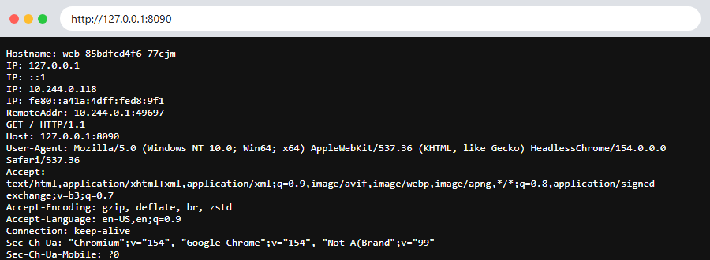

# Session 11: Kubernetes Networking & Services

**Name:** Siddhant Singh
**Roll number:** 24BCS10153

| Task | Where |
| --- | --- |
| Task 1: The 5 Service types | This README + [services/](services/) |
| Task 2: Kubernetes object comparison | [object-comparison/README.md](object-comparison/README.md) |
| Task 3: FQDN | [fqdn/README.md](fqdn/README.md) |
| Task 4: CoreDNS | [coredns/README.md](coredns/README.md) |

---

# Task 1: Kubernetes Services

A **Service** gives a changing set of Pods (selected by **labels**) one **stable** name and IP, and load-balances traffic across them.

```text
             ┌───────── LoadBalancer (external IP) ─────────┐
             │   ┌──────── NodePort (node-ip:30000-32767) ──┐│
             │   │   ┌──── ClusterIP (internal virtual IP) ─┐││
 client ───► │   │   │   kube-proxy ──► Pod / Pod / Pod     │││
             │   │   └──────────────────────────────────────┘││
             │   └──────────────────────────────────────────┘│
             └───────────────────────────────────────────────┘
   ExternalName = DNS CNAME to an outside host (no Pods)
   Headless     = no virtual IP, DNS returns the Pod IPs directly
```

| Type | Reachable from | Gets a ClusterIP? | Typical use |
| --- | --- | --- | --- |
| **ClusterIP** | Inside the cluster only | Yes | Internal microservice-to-microservice traffic |
| **NodePort** | `<NodeIP>:<30000-32767>` | Yes | Simple external access, dev and testing |
| **LoadBalancer** | External IP from a cloud load balancer | Yes | Production external access on a cloud |
| **ExternalName** | Inside the cluster (DNS only) | No | An alias for an outside DB or API |
| **Headless** | Inside the cluster (DNS only) | No (`None`) | StatefulSets, direct Pod discovery |

### Backend application

[00-app-deployment.yaml](services/00-app-deployment.yaml) runs 3 Pods of `traefik/whoami`, which replies with **its own Pod name and IP**, so it is easy to see which Pod served a request. A helper Pod `curl-client` (curl) and `dns-client` (busybox) were used to test from inside the cluster.

```bash
$ kubectl apply -f services/00-app-deployment.yaml
deployment.apps/web created
$ kubectl rollout status deployment/web --timeout=120s
Waiting for deployment "web" rollout to finish: 0 of 3 updated replicas are available...
Waiting for deployment "web" rollout to finish: 1 of 3 updated replicas are available...
Waiting for deployment "web" rollout to finish: 2 of 3 updated replicas are available...
deployment "web" successfully rolled out
$ kubectl get pods -l app=web -o wide | awk '{print $1, $2, $3, $6}' | column -t
NAME                  READY  STATUS   IP
web-85bdfcd4f6-77cjm  1/1    Running  10.244.0.118
web-85bdfcd4f6-k9qnq  1/1    Running  10.244.0.117
web-85bdfcd4f6-rhr5t  1/1    Running  10.244.0.116
```

## 1. ClusterIP: [01-clusterip-service.yaml](services/01-clusterip-service.yaml)

```bash
$ kubectl apply -f services/01-clusterip-service.yaml
service/web-clusterip created
$ kubectl get svc web-clusterip
NAME            TYPE        CLUSTER-IP     EXTERNAL-IP   PORT(S)   AGE
web-clusterip   ClusterIP   10.111.77.60   <none>        80/TCP    0s
$ kubectl get endpointslices -l kubernetes.io/service-name=web-clusterip
NAME                  ADDRESSTYPE   PORTS   ENDPOINTS                                AGE
web-clusterip-wntx9   IPv4          80      10.244.0.118,10.244.0.117,10.244.0.116   0s
$ kubectl exec curl-client -- sh -c 'for i in 1 2 3 4 5 6; do curl -s http://web-clusterip | grep Hostname; done'
Hostname: web-85bdfcd4f6-k9qnq
Hostname: web-85bdfcd4f6-k9qnq
Hostname: web-85bdfcd4f6-k9qnq
Hostname: web-85bdfcd4f6-77cjm
Hostname: web-85bdfcd4f6-k9qnq
Hostname: web-85bdfcd4f6-k9qnq
$ kubectl exec dns-client -- nslookup web-clusterip.default.svc.cluster.local | tail -3
Name:	web-clusterip.default.svc.cluster.local
Address: 10.111.77.60
```

**Verified:** The Service got the virtual IP `10.111.77.60`. Its EndpointSlice lists the **3 Pod IPs** picked by the `app: web` selector. Requests from inside the cluster reached the Pods, and DNS resolves the Service name to the ClusterIP. Nothing outside the cluster can reach it.

## 2. NodePort: [02-nodeport-service.yaml](services/02-nodeport-service.yaml)

```bash
$ kubectl apply -f services/02-nodeport-service.yaml
service/web-nodeport created
$ kubectl get svc web-nodeport
NAME           TYPE       CLUSTER-IP    EXTERNAL-IP   PORT(S)        AGE
web-nodeport   NodePort   10.110.5.23   <none>        80:30080/TCP   0s
$ kubectl get nodes -o jsonpath='Node InternalIP: {.items[0].status.addresses[0].address}{"\n"}'
Node InternalIP: 192.168.49.2
$ kubectl exec curl-client -- sh -c 'curl -s http://192.168.49.2:30080 | grep -E "Hostname|IP: 10"'
Hostname: web-85bdfcd4f6-rhr5t
IP: 10.244.0.116
$ minikube ssh -- "curl -s http://localhost:30080 | grep Hostname"
Hostname: web-85bdfcd4f6-77cjm
$ kubectl describe svc web-nodeport | grep -E "^Type|^IP:|^Port|^TargetPort|^NodePort|^Endpoints"
Type:                     NodePort
IP:                       10.110.5.23
Port:                     <unset>  80/TCP
TargetPort:               80/TCP
NodePort:                 <unset>  30080/TCP
Endpoints:                10.244.0.118:80,10.244.0.117:80,10.244.0.116:80
```

**Ports explained:**

| Field | Value | Meaning |
| --- | --- | --- |
| `nodePort` | 30080 | Opened on **every node** (`192.168.49.2:30080`) |
| `port` | 80 | The Service's own port on its ClusterIP |
| `targetPort` | 80 | The container's port inside the Pod |

**Verified:** Requests to the **node's IP on port 30080**, both from a Pod and from inside the node itself (`minikube ssh`), reached the app. Flow: `NodeIP:30080 → Service:80 → Pod:80`.

## 3. LoadBalancer: [03-loadbalancer-service.yaml](services/03-loadbalancer-service.yaml)

On a cloud (AWS, GCP, Azure) Kubernetes asks the provider for a real load balancer with a public IP. On Minikube, **`minikube tunnel`** plays that role and gives the Service an external IP.

```bash
$ kubectl apply -f services/03-loadbalancer-service.yaml
service/web-loadbalancer created
$ kubectl get svc web-loadbalancer
NAME               TYPE           CLUSTER-IP      EXTERNAL-IP   PORT(S)          AGE
web-loadbalancer   LoadBalancer   10.102.141.77   127.0.0.1     8090:31223/TCP   3s
$ curl -s http://127.0.0.1:8090 | grep -E "Hostname|IP: 10"
Hostname: web-85bdfcd4f6-77cjm
IP: 10.244.0.118
$ for i in $(seq 1 30); do curl -s http://127.0.0.1:8090 | grep Hostname; done | sort | uniq -c
     10 Hostname: web-85bdfcd4f6-77cjm
     10 Hostname: web-85bdfcd4f6-k9qnq
     10 Hostname: web-85bdfcd4f6-rhr5t
$ kubectl get svc
NAME               TYPE           CLUSTER-IP      EXTERNAL-IP   PORT(S)          AGE
external-example   ExternalName   <none>          example.com   <none>           38s
kubernetes         ClusterIP      10.96.0.1       <none>        443/TCP          11d
web-clusterip      ClusterIP      10.111.77.60    <none>        80/TCP           42s
web-headless       ClusterIP      None            <none>        80/TCP           36s
web-loadbalancer   LoadBalancer   10.102.141.77   127.0.0.1     8090:31223/TCP   7s
web-nodeport       NodePort       10.110.5.23     <none>        80:30080/TCP     40s
```



**Verified:** `EXTERNAL-IP` changed from `<pending>` to **`127.0.0.1`**, and the app opened from my own machine (outside the cluster) at `http://127.0.0.1:8090`. Over 30 requests the load was spread **evenly: 10 / 10 / 10** across the 3 Pods. A LoadBalancer Service also gets a NodePort (`31223`) and a ClusterIP, because each type builds on the one before it.

## 4. ExternalName: [04-externalname-service.yaml](services/04-externalname-service.yaml)

```bash
$ kubectl apply -f services/04-externalname-service.yaml
service/external-example created
$ kubectl get svc external-example
NAME               TYPE           CLUSTER-IP   EXTERNAL-IP   PORT(S)   AGE
external-example   ExternalName   <none>       example.com   <none>    1s
$ kubectl exec dns-client -- nslookup external-example.default.svc.cluster.local
Server:		10.96.0.10
Address:	10.96.0.10:53

external-example.default.svc.cluster.local	canonical name = example.com

external-example.default.svc.cluster.local	canonical name = example.com
Name:	example.com
Address: 104.20.23.154
Name:	example.com
Address: 172.66.147.243

$ kubectl exec curl-client -- sh -c 'curl -s -o /dev/null -w "HTTP %{http_code} from %{remote_ip}\n" -H "Host: example.com" http://external-example'
HTTP 200 from 104.20.23.154
```

**Verified:** There is **no ClusterIP and no Pods**. The cluster DNS returns a **CNAME** (`canonical name = example.com`), so Pods can use the in-cluster name `external-example` to reach an outside host. If the external host changes, only the Service needs updating, not every app.

## 5. Headless: [05-headless-service.yaml](services/05-headless-service.yaml)

```bash
$ kubectl apply -f services/05-headless-service.yaml
service/web-headless created
$ kubectl get svc web-headless
NAME           TYPE        CLUSTER-IP   EXTERNAL-IP   PORT(S)   AGE
web-headless   ClusterIP   None         <none>        80/TCP    1s
$ kubectl exec dns-client -- nslookup web-headless.default.svc.cluster.local
Server:		10.96.0.10
Address:	10.96.0.10:53


Name:	web-headless.default.svc.cluster.local
Address: 10.244.0.117
Name:	web-headless.default.svc.cluster.local
Address: 10.244.0.118
Name:	web-headless.default.svc.cluster.local
Address: 10.244.0.116

$ kubectl get pods -l app=web -o custom-columns=POD:.metadata.name,IP:.status.podIP
POD                    IP
web-85bdfcd4f6-77cjm   10.244.0.118
web-85bdfcd4f6-k9qnq   10.244.0.117
web-85bdfcd4f6-rhr5t   10.244.0.116
$ kubectl exec curl-client -- sh -c 'for i in 1 2 3; do curl -s http://web-headless | grep Hostname; done'
Hostname: web-85bdfcd4f6-rhr5t
Hostname: web-85bdfcd4f6-rhr5t
Hostname: web-85bdfcd4f6-77cjm
```

**Verified:** `CLUSTER-IP` is **`None`**. A DNS lookup of the Service returns **the 3 Pod IPs directly** (`10.244.0.116`, `.117`, `.118`), the same IPs `kubectl get pods` shows, instead of one virtual IP. The client then chooses a Pod itself. StatefulSets such as databases use this to reach a specific replica (`pod-0.svc-name`).

### All Services together

```bash
$ kubectl get svc web-loadbalancer
NAME               TYPE           CLUSTER-IP      EXTERNAL-IP   PORT(S)          AGE
web-loadbalancer   LoadBalancer   10.102.141.77   127.0.0.1     8090:31223/TCP   3s
$ curl -s http://127.0.0.1:8090 | grep -E "Hostname|IP: 10"
Hostname: web-85bdfcd4f6-77cjm
IP: 10.244.0.118
$ for i in $(seq 1 30); do curl -s http://127.0.0.1:8090 | grep Hostname; done | sort | uniq -c
     10 Hostname: web-85bdfcd4f6-77cjm
     10 Hostname: web-85bdfcd4f6-k9qnq
     10 Hostname: web-85bdfcd4f6-rhr5t
$ kubectl get svc
NAME               TYPE           CLUSTER-IP      EXTERNAL-IP   PORT(S)          AGE
external-example   ExternalName   <none>          example.com   <none>           38s
kubernetes         ClusterIP      10.96.0.1       <none>        443/TCP          11d
web-clusterip      ClusterIP      10.111.77.60    <none>        80/TCP           42s
web-headless       ClusterIP      None            <none>        80/TCP           36s
web-loadbalancer   LoadBalancer   10.102.141.77   127.0.0.1     8090:31223/TCP   7s
web-nodeport       NodePort       10.110.5.23     <none>        80:30080/TCP     40s
```
