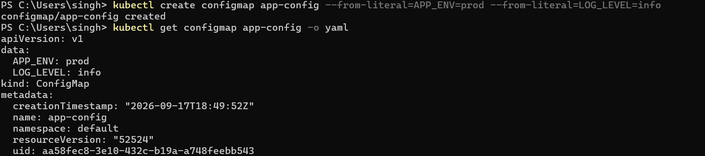
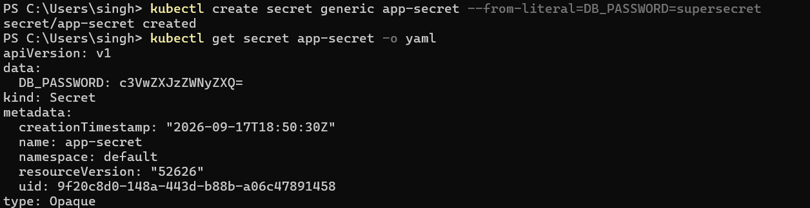
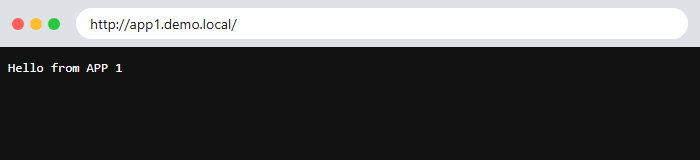
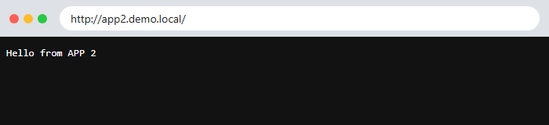

# Session 12: Kubernetes Ingress, ConfigMaps & Secrets

**Name:** Siddhant Singh
**Roll number:** 24BCS10153

| Task | Files |
| --- | --- |
| Task 1: ConfigMap | [configmap/configmap.yaml](configmap/configmap.yaml), [configmap/pod-with-configmap.yaml](configmap/pod-with-configmap.yaml) |
| Task 2: Secret | [secret/secret.yaml](secret/secret.yaml), [secret/pod-with-secret.yaml](secret/pod-with-secret.yaml) |
| Task 3: Ingress | [ingress/apps.yaml](ingress/apps.yaml), [ingress/ingress.yaml](ingress/ingress.yaml) |
| Task 4: Ingress vs Ingress Controller | [ingress-vs-ingress-controller/README.md](ingress-vs-ingress-controller/README.md) |
| Task 5: Troubleshooting | [troubleshooting/README.md](troubleshooting/README.md) |

---

## Task 1: ConfigMap

A **ConfigMap** stores **non-sensitive configuration** (environment names, log levels, config files) separately from the container image, so the same image can run in dev, staging and production with different settings.

### Quick start (imperative)



### Complete demo (declarative YAML)

The Pod consumes the ConfigMap in **three ways**: a single key as an env var (`configMapKeyRef`), all keys as env vars (`envFrom`), and as **files** in a volume.

```bash
$ kubectl apply -f configmap/configmap.yaml
configmap/app-config created
$ kubectl get configmap app-config
NAME         DATA   AGE
app-config   4      0s
$ kubectl describe configmap app-config | sed -n '/^Data/,/^BinaryData/p'
Data
====
APP_ENV:
----
production

LOG_LEVEL:
----
info

MAX_CONNECTIONS:
----
100

app.properties:
----
app.name=devops-demo
app.theme=dark
feature.new-ui=true


BinaryData
$ kubectl apply -f configmap/pod-with-configmap.yaml
pod/configmap-demo created
$ kubectl wait --for=condition=Ready pod/configmap-demo --timeout=90s
pod/configmap-demo condition met
$ kubectl exec configmap-demo -- printenv APP_ENV LOG_LEVEL MAX_CONNECTIONS
production
info
100
$ kubectl exec configmap-demo -- ls /etc/config
APP_ENV
LOG_LEVEL
MAX_CONNECTIONS
app.properties
$ kubectl exec configmap-demo -- cat /etc/config/app.properties
app.name=devops-demo
app.theme=dark
feature.new-ui=true
$ kubectl patch configmap app-config --type merge -p '{"data":{"LOG_LEVEL":"debug"}}'
configmap/app-config patched
$ kubectl exec configmap-demo -- cat /etc/config/LOG_LEVEL; echo
debug
$ kubectl exec configmap-demo -- printenv LOG_LEVEL
info
```

### What I verified

- **Create and store:** The ConfigMap holds 4 keys, including a whole `app.properties` file.
- **Inject:** Inside the container, the env vars `APP_ENV=production`, `LOG_LEVEL=info` and `MAX_CONNECTIONS=100` are set, and every key appears as a file under `/etc/config/`.
- **Update behaviour:** After I changed `LOG_LEVEL` to `debug`, the **mounted file updated automatically** (after about a minute, at the kubelet's next sync), but the **env var still says `info`**. Environment variables are read only once, when the container starts, so a Pod restart is needed to pick them up.

---

## Task 2: Secret

A **Secret** is like a ConfigMap but meant for **sensitive data** (passwords, tokens, keys). Kubernetes keeps it separate, can encrypt it at rest in etcd, restricts it with RBAC, and mounts it on **tmpfs** (in memory, never written to the node's disk).

### Quick start (imperative)



### Complete demo (declarative YAML)

```bash
$ kubectl apply -f secret/secret.yaml
secret/db-secret created
$ kubectl get secret db-secret
NAME        TYPE     DATA   AGE
db-secret   Opaque   2      0s
$ kubectl describe secret db-secret | sed -n '/^Type/,$p'
Type:  Opaque

Data
====
DB_PASSWORD:  10 bytes
DB_USER:      5 bytes
$ kubectl get secret db-secret -o jsonpath='{.data.DB_PASSWORD}'; echo
UzNjdXJlUEBzcw==
$ kubectl get secret db-secret -o jsonpath='{.data.DB_PASSWORD}' | base64 -d; echo
S3cureP@ss
$ kubectl apply -f secret/pod-with-secret.yaml
pod/secret-demo created
$ kubectl wait --for=condition=Ready pod/secret-demo --timeout=90s
pod/secret-demo condition met
$ kubectl exec secret-demo -- printenv DB_USER DB_PASSWORD
admin
S3cureP@ss
$ kubectl exec secret-demo -- ls -l /etc/secret/
total 0
lrwxrwxrwx    1 root     root            18 Oct  7 15:14 DB_PASSWORD -> ..data/DB_PASSWORD
lrwxrwxrwx    1 root     root            14 Oct  7 15:14 DB_USER -> ..data/DB_USER
$ kubectl exec secret-demo -- cat /etc/secret/DB_PASSWORD; echo
S3cureP@ss
$ kubectl exec secret-demo -- mount | grep /etc/secret
tmpfs on /etc/secret type tmpfs (ro,relatime,size=7978476k,noswap)
$ kubectl create secret generic api-key --from-literal=API_KEY=demo-12345 --dry-run=client -o yaml
apiVersion: v1
data:
  API_KEY: ZGVtby0xMjM0NQ==
kind: Secret
metadata:
  name: api-key
```

### What I verified

- **Create and store:** `kubectl describe` hides the values (shows only `10 bytes`), but `-o jsonpath` shows the **base64** string `UzNjdXJlUEBzcw==`, which anyone can decode back to `S3cureP@ss`.
- **Inject:** Inside the container, `DB_USER=admin` and `DB_PASSWORD=S3cureP@ss` are set as env vars and also exist as files in `/etc/secret/`.
- `mount` shows `/etc/secret` is **`tmpfs` (in memory) and `ro` (read-only)**.

### Why Secrets should NOT be committed to Git

1. **base64 is encoding, not encryption.** The demo above decoded the password with one command (`base64 -d`). A Secret YAML in Git is effectively a plain-text password.
2. **Git history is forever.** Even if the file is deleted later, the password stays in old commits, forks and clones.
3. **Repos get shared.** Teammates, CI systems, forks, or a repo accidentally made public all expose it. Bots scan GitHub for leaked keys within minutes.
4. **Rotation is painful.** Once leaked, every system using that credential must be changed.

**What to do instead:** Create Secrets at deploy time (`kubectl create secret ... --from-literal` in CI, using CI/CD secret variables), or use **Sealed Secrets** / **SOPS** (encrypted files that are safe to commit), an **External Secrets Operator** with AWS Secrets Manager or HashiCorp Vault, and enable **encryption at rest** for etcd. Add secret files to `.gitignore` and run secret scanners such as gitleaks. The `db-secret` in this repo only holds made-up **demo** values.

---

## Task 3: Ingress

An **Ingress** routes external HTTP(S) traffic to Services **by hostname and URL path**, through a **single entry point**, instead of one LoadBalancer per Service. Minikube's `ingress` addon provides the **NGINX Ingress Controller**, and `minikube tunnel` exposes it on `127.0.0.1:80`.

```text
                                ┌─ /app1  ─► app1-svc ─► app1 Pods
client ─► 127.0.0.1:80 ─► NGINX Ingress Controller (demo.local)
                                └─ /app2  ─► app2-svc ─► app2 Pods
                                ┌─ app1.demo.local ─► app1-svc
                                └─ app2.demo.local ─► app2-svc
```

```bash
$ kubectl get pods -n ingress-nginx -l app.kubernetes.io/component=controller
NAME                                       READY   STATUS    RESTARTS        AGE
ingress-nginx-controller-d7cd8c989-t4zzg   1/1     Running   150 (58m ago)   19d
$ kubectl get ingressclass
NAME              CONTROLLER             PARAMETERS   AGE
nginx (default)   k8s.io/ingress-nginx   <none>       19d
$ kubectl apply -f ingress/apps.yaml
deployment.apps/app1 created
deployment.apps/app2 created
service/app1-svc created
service/app2-svc created
$ kubectl rollout status deployment/app1 --timeout=90s && kubectl rollout status deployment/app2 --timeout=90s
Waiting for deployment "app1" rollout to finish: 0 of 2 updated replicas are available...
Waiting for deployment "app1" rollout to finish: 1 of 2 updated replicas are available...
deployment "app1" successfully rolled out
deployment "app2" successfully rolled out
$ kubectl get deploy,svc -l '!x' | grep -E "NAME|app1|app2"
NAME                   READY   UP-TO-DATE   AVAILABLE   AGE
deployment.apps/app1   2/2     2            2           3s
deployment.apps/app2   2/2     2            2           3s
NAME                 TYPE        CLUSTER-IP      EXTERNAL-IP   PORT(S)   AGE
service/app1-svc     ClusterIP   10.99.109.126   <none>        80/TCP    3s
service/app2-svc     ClusterIP   10.106.90.226   <none>        80/TCP    3s
$ kubectl apply -f ingress/ingress.yaml
ingress.networking.k8s.io/demo-ingress created
ingress.networking.k8s.io/host-ingress created
$ kubectl get ingress
NAME           CLASS   HOSTS                             ADDRESS        PORTS   AGE
demo-ingress   nginx   demo.local                        192.168.49.2   80      23s
host-ingress   nginx   app1.demo.local,app2.demo.local   192.168.49.2   80      23s
$ kubectl describe ingress demo-ingress | sed -n '/^Rules/,/^Annotations/p'
Rules:
  Host        Path  Backends
  ----        ----  --------
  demo.local  
              /app1(/|$)(.*)   app1-svc:80 (10.244.0.124:5678,10.244.0.125:5678)
              /app2(/|$)(.*)   app2-svc:80 (10.244.0.126:5678,10.244.0.127:5678)
Annotations:  nginx.ingress.kubernetes.io/rewrite-target: /$2
$ curl -s -H "Host: demo.local" http://127.0.0.1/app1
Hello from APP 1
$ curl -s -H "Host: demo.local" http://127.0.0.1/app2
Hello from APP 2
$ curl -s -o /dev/null -w "HTTP %{http_code}\n" -H "Host: demo.local" http://127.0.0.1/app3
HTTP 404
$ curl -s -H "Host: app1.demo.local" http://127.0.0.1/
Hello from APP 1
$ curl -s -H "Host: app2.demo.local" http://127.0.0.1/
Hello from APP 2
$ curl -s -o /dev/null -w "HTTP %{http_code}\n" -H "Host: unknown.local" http://127.0.0.1/
HTTP 404
$ kubectl logs -n ingress-nginx -l app.kubernetes.io/component=controller --tail=20 | grep '"GET ' | tail -6
10.244.0.1 - - [07/Oct/2026:15:15:32 +0000] "GET /app1 HTTP/1.1" 200 17 "-" "curl/8.9.0" 77 0.005 [default-app1-svc-80] [] 10.244.0.124:5678 17 0.005 200 f51dbea2bed647e177a90f37110b7058
10.244.0.1 - - [07/Oct/2026:15:15:32 +0000] "GET /app2 HTTP/1.1" 200 17 "-" "curl/8.9.0" 77 0.002 [default-app2-svc-80] [] 10.244.0.127:5678 17 0.001 200 99a7002013af04c7365ca88b3b828f9b
10.244.0.1 - - [07/Oct/2026:15:15:32 +0000] "GET /app3 HTTP/1.1" 404 146 "-" "curl/8.9.0" 77 0.001 [upstream-default-backend] [] 127.0.0.1:8181 146 0.001 404 ba7fb892bb0a0bde9f9a7286f17e6f44
10.244.0.1 - - [07/Oct/2026:15:15:32 +0000] "GET / HTTP/1.1" 200 17 "-" "curl/8.9.0" 78 0.002 [default-app1-svc-80] [] 10.244.0.124:5678 17 0.001 200 f57daa49273693cd95ca3f23e39bac64
10.244.0.1 - - [07/Oct/2026:15:15:32 +0000] "GET / HTTP/1.1" 200 17 "-" "curl/8.9.0" 78 0.001 [default-app2-svc-80] [] 10.244.0.126:5678 17 0.002 200 9ad5eff3c30ea805fc60fad6715c95b9
```

### Browser screenshots (through the Ingress)

| URL | Result |
| --- | --- |
| `http://demo.local/app1` |  |
| `http://demo.local/app2` |  |
| `http://app1.demo.local/` |  |
| `http://app2.demo.local/` |  |

*(For the browser, `demo.local` and `*.demo.local` were mapped to `127.0.0.1`, the same thing a `hosts`-file entry does.)*

### What I verified

- **Deploy and Service:** Two apps, each with 2 Pods behind a ClusterIP Service.
- **Configure:** The Ingress got the address `192.168.49.2`, and `describe` shows each rule mapped to its Service **and the real Pod IPs** behind it.
- **Path-based routing:** `/app1` → APP 1 and `/app2` → APP 2. An unknown path (`/app3`) gives **404** from the controller's default backend.
- **Host-based routing:** `app1.demo.local` → APP 1, `app2.demo.local` → APP 2, and an unknown host gives **404**.
- The controller's access log shows each request and which **upstream Service** handled it (`[default-app1-svc-80]`, `[upstream-default-backend]`).
