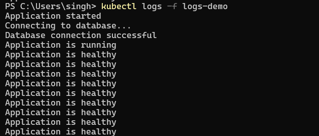
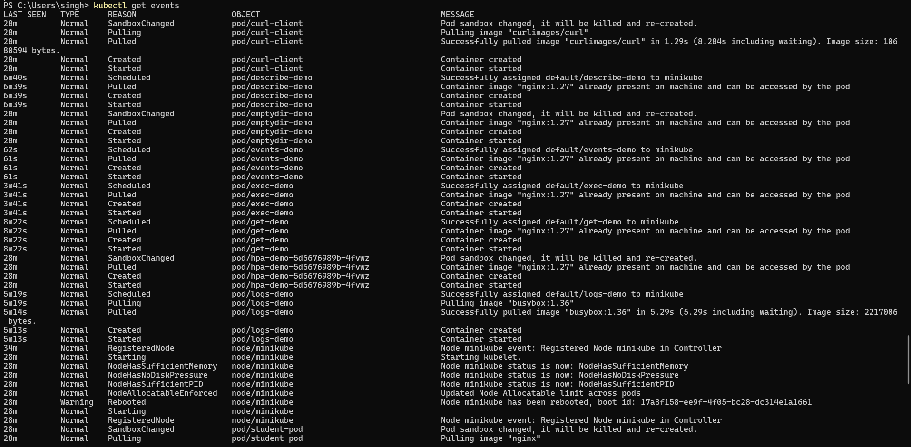
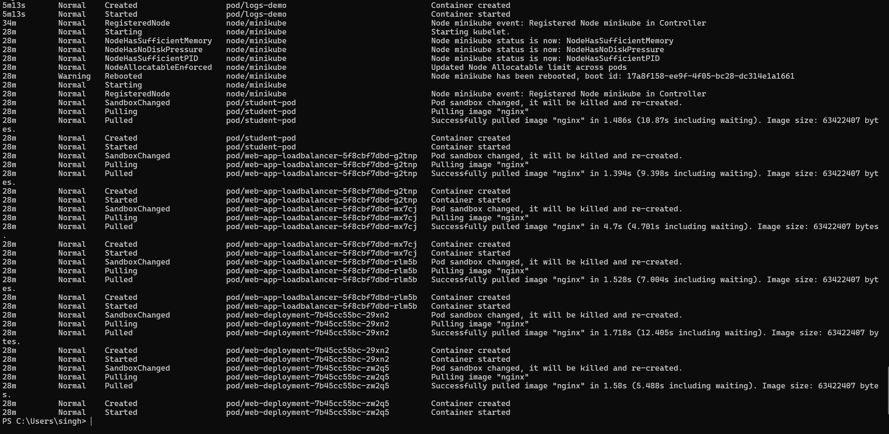

# Task 1: Kubernetes Troubleshooting Commands

**Name:** Siddhant Singh · **Roll number:** 24BCS10153

All commands were practised against the mini-project app (`troubleshooting-app`: 2 nginx Pods + `troubleshooting-service`).

| Command | Answers the question | Typical use |
| --- | --- | --- |
| `kubectl get` | **What** exists and what state is it in? | First look: STATUS, READY, RESTARTS |
| `kubectl get -o wide` | **Where** is it running? | Pod IP, node, extra columns |
| `kubectl describe` | **Why** is it in this state? | Conditions and **Events** (scheduling, pulls, probes) |
| `kubectl logs` | What did the **app** say? | Errors from the application itself |
| `kubectl exec` | What does it look like **inside** the container? | Test localhost, files, env, DNS |
| `kubectl events` | What happened **recently** in the cluster? | A timeline of warnings |
| `kubectl explain` | What does this **field** mean? | Built-in API documentation |
| `kubectl top` | How much **CPU and memory** is used? | Resource pressure, HPA, OOM |

---

## 1. `kubectl get`

```bash
$ kubectl get nodes
NAME       STATUS   ROLES           AGE   VERSION
minikube   Ready    control-plane   22d   v1.37.0
$ kubectl get pods
NAME                                  READY   STATUS    RESTARTS   AGE
curl-client                           1/1     Running   0          73m
dns-client                            1/1     Running   0          55m
troubleshooting-app-8d954599c-rnrcl   1/1     Running   0          74s
troubleshooting-app-8d954599c-sk5hk   1/1     Running   0          74s
$ kubectl get deployment/troubleshooting-app service/troubleshooting-service
NAME                                  READY   UP-TO-DATE   AVAILABLE   AGE
deployment.apps/troubleshooting-app   2/2     2            2           74s

NAME                              TYPE        CLUSTER-IP     EXTERNAL-IP   PORT(S)   AGE
service/troubleshooting-service   ClusterIP   10.107.9.255   <none>        80/TCP    74s
$ kubectl get pods -A --field-selector=status.phase!=Running,status.phase!=Succeeded
No resources found
$ kubectl run oops --image=busybox:1.36 --restart=Never -- sh -c 'exit 3'
pod/oops created
$ kubectl get pods -A --field-selector=status.phase!=Running,status.phase!=Succeeded
NAMESPACE   NAME   READY   STATUS   RESTARTS   AGE
default     oops   0/1     Error    0          6s
$ kubectl get pod oops -o jsonpath='exitCode={.status.containerStatuses[0].state.terminated.exitCode}'; echo
exitCode=3
```

`--field-selector status.phase!=Running` lists only the unhealthy Pods in every namespace, which makes a quick health check. The `oops` Pod exited with code 3, so it showed up as `Error`.

## 2. `kubectl get -o wide` (and other output formats)

```bash
$ kubectl get pods -o wide
NAME                                  READY   STATUS    RESTARTS   AGE   IP             NODE       NOMINATED NODE   READINESS GATES
curl-client                           1/1     Running   0          73m   10.244.0.63    minikube   <none>           <none>
dns-client                            1/1     Running   0          55m   10.244.0.115   minikube   <none>           <none>
troubleshooting-app-8d954599c-rnrcl   1/1     Running   0          81s   10.244.0.184   minikube   <none>           <none>
troubleshooting-app-8d954599c-sk5hk   1/1     Running   0          81s   10.244.0.185   minikube   <none>           <none>
$ kubectl get nodes -o wide
NAME       STATUS   ROLES           AGE   VERSION   INTERNAL-IP    EXTERNAL-IP   OS-IMAGE                         KERNEL-VERSION                              CONTAINER-RUNTIME
minikube   Ready    control-plane   22d   v1.37.0   192.168.49.2   <none>        Debian GNU/Linux 12 (bookworm)   6.18.40.1-microsoft-standard-WSL2 (amd64)   containerd://2.3.4
$ kubectl get pod -l app=troubleshooting-app -o yaml | grep -A3 "containerStatuses:" | head -4
    containerStatuses:
    - containerID: containerd://f24fa1ff8b02669dd2ed937eb461e3f4fbec0de614b21e4566328554f63f7039
      image: docker.io/library/nginx:1.27
      imageID: docker.io/library/nginx@sha256:6784fb0834aa7dbbe12e3d7471e69c290df3e6ba810dc38b34ae33d3c1c05f7d
$ kubectl get pods -l app=troubleshooting-app -o custom-columns=NAME:.metadata.name,IP:.status.podIP,NODE:.spec.nodeName,IMAGE:.spec.containers[0].image
NAME                                  IP             NODE       IMAGE
troubleshooting-app-8d954599c-rnrcl   10.244.0.184   minikube   nginx:1.27
troubleshooting-app-8d954599c-sk5hk   10.244.0.185   minikube   nginx:1.27
```

`-o wide` adds **IP and NODE**. `-o yaml` shows the full object, including `status`. `-o custom-columns` and `-o jsonpath` pick out exact fields.

## 3. `kubectl describe`

```bash
$ POD=$(kubectl get pod -l app=troubleshooting-app -o jsonpath='{.items[0].metadata.name}') && kubectl describe pod $POD | sed -n '1,12p;/^Conditions:/,/^Volumes:/p;/^Events:/,$p'
Name:             troubleshooting-app-8d954599c-rnrcl
Namespace:        default
Priority:         0
Service Account:  default
Node:             minikube/192.168.49.2
Start Time:       Wed, 07 Oct 2026 21:31:26 +0530
Labels:           app=troubleshooting-app
                  pod-template-hash=8d954599c
Annotations:      <none>
Status:           Running
IP:               10.244.0.184
IPs:
Conditions:
  Type                        Status
  PodReadyToStartContainers   True 
  Initialized                 True 
  Ready                       True 
  ContainersReady             True 
  PodScheduled                True 
Volumes:
Events:
  Type    Reason     Age   From               Message
  ----    ------     ----  ----               -------
  Normal  Scheduled  82s   default-scheduler  Successfully assigned default/troubleshooting-app-8d954599c-rnrcl to minikube
  Normal  Pulled     81s   kubelet            Container image "nginx:1.27" already present on machine and can be accessed by the pod
  Normal  Created    81s   kubelet            Container created
  Normal  Started    81s   kubelet            Container started
$ kubectl describe deployment troubleshooting-app | grep -E "Replicas|StrategyType|Image|NewReplicaSet"
Replicas:               2 desired | 2 updated | 2 total | 2 available | 0 unavailable
StrategyType:           RollingUpdate
    Image:         nginx:1.27
  Available      True    MinimumReplicasAvailable
  Progressing    True    NewReplicaSetAvailable
NewReplicaSet:   troubleshooting-app-8d954599c (2/2 replicas created)
```

The **Events** section at the bottom is the most useful part when debugging. It shows scheduling, image pulls, container start, probe failures and back-offs.

## 4. `kubectl logs`

### My earlier screenshot: `kubectl logs -f logs-demo`



### More `logs` options

```bash
$ POD=$(kubectl get pod -l app=troubleshooting-app -o jsonpath='{.items[0].metadata.name}') && kubectl exec curl-client -- curl -s -o /dev/null http://troubleshooting-service && kubectl logs $POD --tail=3
127.0.0.1 - - [07/Oct/2026:16:01:29 +0000] "GET / HTTP/1.1" 200 615 "-" "curl/7.88.1" "-"
10.244.0.63 - - [07/Oct/2026:16:01:31 +0000] "GET / HTTP/1.1" 200 615 "-" "curl/8.22.0" "-"
10.244.0.63 - - [07/Oct/2026:16:02:48 +0000] "GET / HTTP/1.1" 200 615 "-" "curl/8.22.0" "-"
$ kubectl logs deployment/troubleshooting-app --tail=2 --timestamps
Found 2 pods, using pod/troubleshooting-app-8d954599c-rnrcl
2026-10-07T16:01:31.045488042Z 10.244.0.63 - - [07/Oct/2026:16:01:31 +0000] "GET / HTTP/1.1" 200 615 "-" "curl/8.22.0" "-"
2026-10-07T16:02:48.774152714Z 10.244.0.63 - - [07/Oct/2026:16:02:48 +0000] "GET / HTTP/1.1" 200 615 "-" "curl/8.22.0" "-"
$ kubectl logs -l app=troubleshooting-app --tail=1 --prefix
[pod/troubleshooting-app-8d954599c-rnrcl/nginx] 10.244.0.63 - - [07/Oct/2026:16:02:48 +0000] "GET / HTTP/1.1" 200 615 "-" "curl/8.22.0" "-"
[pod/troubleshooting-app-8d954599c-sk5hk/nginx] 2026/10/07 16:02:21 [error] 30#30: *2 open() "/usr/share/nginx/html/live-follow-test" failed (2: No such file or directory), client: 10.244.0.63, server: localhost, request: "GET /live-follow-test HTTP/1.1", host: "troubleshooting-service"
$ POD=$(kubectl get pod -l app=troubleshooting-app -o jsonpath='{.items[0].metadata.name}') && timeout 6 kubectl logs -f $POD --since=1s & sleep 2; kubectl exec curl-client -- curl -s -o /dev/null http://troubleshooting-service/live-follow-test; wait
```

| Option | Use |
| --- | --- |
| `--tail=N` | Last N lines |
| `-f` | Follow live. Above, a request made while following appeared immediately |
| `--timestamps` | Add a timestamp to each line |
| `deployment/<name>` or `-l app=...` with `--prefix` | Logs from Pods by owner or label |
| `--previous` | Logs of the **previous (crashed)** container, the key command for CrashLoopBackOff |
| `-c <container>` | Pick one container in a multi-container Pod |

## 5. `kubectl exec`

```bash
$ POD=$(kubectl get pod -l app=troubleshooting-app -o jsonpath='{.items[0].metadata.name}') && kubectl exec $POD -- nginx -v
nginx version: nginx/1.27.5
$ POD=$(kubectl get pod -l app=troubleshooting-app -o jsonpath='{.items[0].metadata.name}') && kubectl exec $POD -- sh -c 'hostname; cat /etc/resolv.conf | head -1; ls /usr/share/nginx/html'
troubleshooting-app-8d954599c-rnrcl
search default.svc.cluster.local svc.cluster.local cluster.local
50x.html
index.html
$ POD=$(kubectl get pod -l app=troubleshooting-app -o jsonpath='{.items[0].metadata.name}') && kubectl exec $POD -- env | grep -E "HOSTNAME|TROUBLESHOOTING_SERVICE_SERVICE"
HOSTNAME=troubleshooting-app-8d954599c-rnrcl
TROUBLESHOOTING_SERVICE_SERVICE_PORT=80
TROUBLESHOOTING_SERVICE_SERVICE_HOST=10.107.9.255
```

`exec` runs commands **inside** the container: check versions, files, `resolv.conf` (DNS), environment variables (Kubernetes injects `<SERVICE>_SERVICE_HOST/PORT`), or open a shell with `kubectl exec -it <pod> -- sh`.

## 6. `kubectl events`

### My earlier screenshots: `kubectl get events`




### `kubectl events` (newer command) and sorted `get events`

```bash
$ kubectl events --for deployment/troubleshooting-app
LAST SEEN   TYPE     REASON              OBJECT                           MESSAGE
11m         Normal   ScalingReplicaSet   Deployment/troubleshooting-app   Scaled up replica set troubleshooting-app-8d954599c from 0 to 2
91s         Normal   ScalingReplicaSet   Deployment/troubleshooting-app   Scaled up replica set troubleshooting-app-8d954599c from 0 to 2
$ kubectl events --types=Warning | tail -5
108s                    Warning   Failed                         Pod/frontend                               Error: ImagePullBackOff
103s (x42 over 11m)     Warning   Failed                         Pod/project-broken-pod                     Error: ImagePullBackOff
83s                     Warning   Failed                         Pod/project-broken-pod                     Error: ImagePullBackOff
68s (x2 over 83s)       Warning   Failed                         Pod/project-broken-pod                     Failed to pull image "nginx:this-tag-does-not-exist": rpc error: code = NotFound desc = failed to pull and unpack image "docker.io/library/nginx:this-tag-does-not-exist": failed to resolve reference "docker.io/library/nginx:this-tag-does-not-exist": docker.io/library/nginx:this-tag-does-not-exist: not found
68s (x2 over 83s)       Warning   Failed                         Pod/project-broken-pod                     Error: ErrImagePull
$ kubectl get events --sort-by=.lastTimestamp | tail -6
48s         Normal    Scheduled                      pod/oops                                    Successfully assigned default/oops to minikube
47s         Normal    Started                        pod/oops                                    Container started
17s         Normal    Scheduled                      pod/oops                                    Successfully assigned default/oops to minikube
16s         Normal    Pulled                         pod/oops                                    Container image "busybox:1.36" already present on machine and can be accessed by the pod
16s         Normal    Started                        pod/oops                                    Container started
16s         Normal    Created                        pod/oops                                    Container created
```

`--for <object>` filters to one resource, and `--types=Warning` shows only problems. These Warnings come from the troubleshooting scenarios in [Task 2](../02-common-issues/README.md). Events are kept for about **1 hour** only.

## 7. `kubectl explain`

```bash
$ kubectl explain pod.spec.containers.livenessProbe | head -12
KIND:       Pod
VERSION:    v1

FIELD: livenessProbe <Probe>


DESCRIPTION:
    Periodic probe of container liveness. Container will be restarted if the
    probe fails. Cannot be updated. More info:
    https://kubernetes.io/docs/concepts/workloads/pods/pod-lifecycle#container-probes
    Probe describes a health check to be performed against a container to
    determine whether it is alive or ready to receive traffic.
$ kubectl explain deployment.spec.strategy --recursive | head -22
GROUP:      apps
KIND:       Deployment
VERSION:    v1

FIELD: strategy <DeploymentStrategy>


DESCRIPTION:
    The deployment strategy to use to replace existing pods with new ones.
    DeploymentStrategy describes how to replace existing pods with new ones.
    
FIELDS:
  rollingUpdate	<RollingUpdateDeployment>
    maxSurge	<IntOrString>
    maxUnavailable	<IntOrString>
  type	<string>
  enum: Recreate, RollingUpdate
```

Built-in documentation for every field, taken from the cluster's real API version. `--recursive` shows the whole tree, including allowed values (`enum: Recreate, RollingUpdate`).

## 8. `kubectl top`

```bash
$ kubectl top nodes
NAME       CPU(cores)   CPU(%)   MEMORY(bytes)   MEMORY(%)   
minikube   440m         3%       1776Mi          22%         
$ kubectl top pods -l app=troubleshooting-app
NAME                                  CPU(cores)   MEMORY(bytes)   
troubleshooting-app-8d954599c-rnrcl   1m           9Mi             
troubleshooting-app-8d954599c-sk5hk   4m           9Mi             
$ kubectl top pods -A --sort-by=memory | head -6
NAMESPACE       NAME                                       CPU(cores)   MEMORY(bytes)   
kube-system     kube-apiserver-minikube                    132m         306Mi           
kube-system     etcd-minikube                              70m          291Mi           
ingress-nginx   ingress-nginx-controller-d7cd8c989-t4zzg   4m           151Mi           
kube-system     kube-controller-manager-minikube           37m          74Mi            
kube-system     kube-scheduler-minikube                    14m          36Mi            
```

This needs **metrics-server**. `--sort-by=memory` or `cpu` finds the heaviest Pods. It is used to troubleshoot OOMKilled containers, CPU throttling and HPA decisions.
