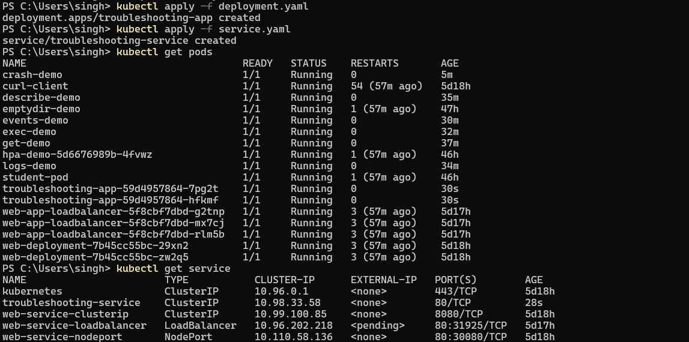
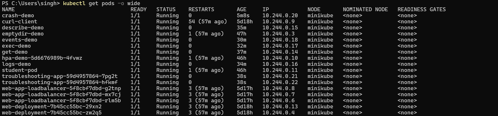
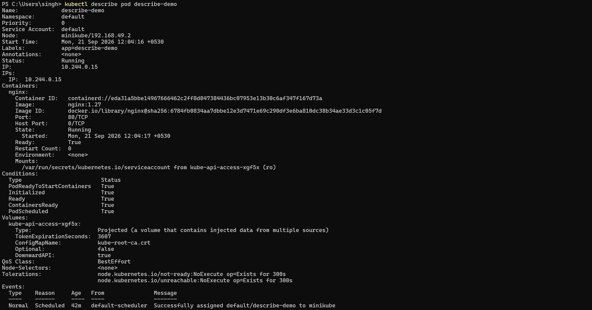
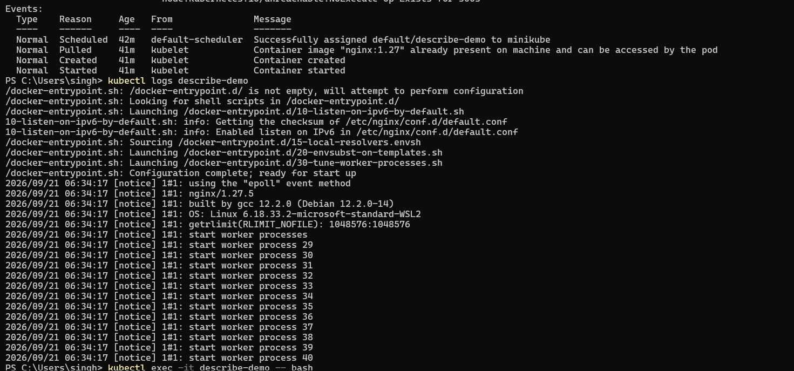
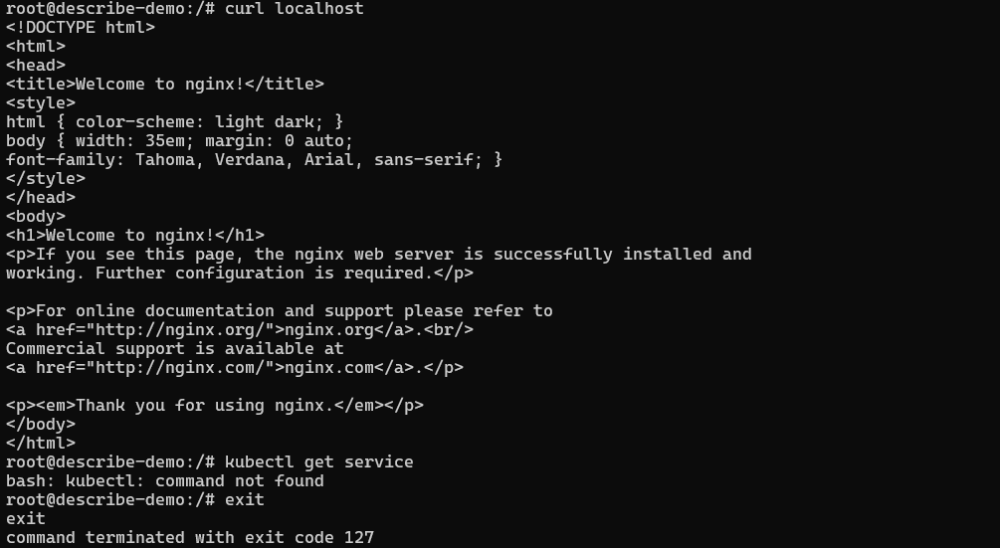
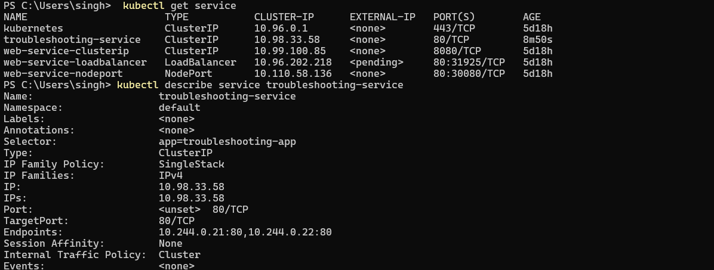
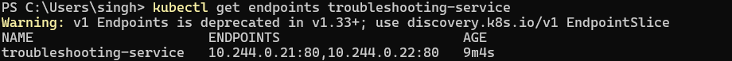
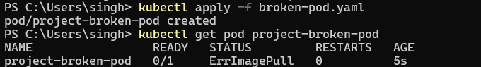
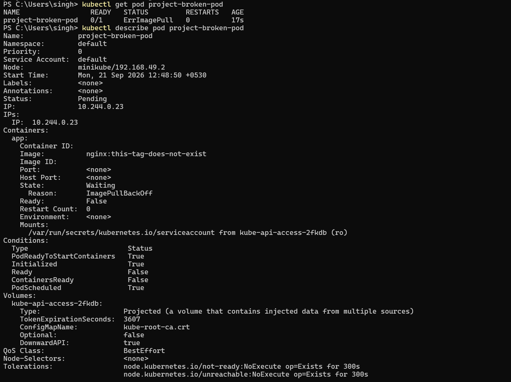

# Task 3: Mini Project: Kubernetes Troubleshooting Challenge

**Name:** Siddhant Singh · **Roll number:** 24BCS10153

```text
Deploy → Observe → Break → Investigate → Find root cause → Fix → Verify
```

## Project scenario

A simple **Nginx application** runs in Kubernetes as a **Deployment** ([deployment.yaml](deployment.yaml), 2 replicas), a **Service** ([service.yaml](service.yaml)) and its **Pods**. The application should be reachable through the Service, but the team has reported that something is wrong. The job is to find and fix the problem.

| File | Purpose |
| --- | --- |
| [deployment.yaml](deployment.yaml) | `troubleshooting-app`: 2 × `nginx:1.27`, label `app=troubleshooting-app` |
| [service.yaml](service.yaml) | `troubleshooting-service`: ClusterIP, port 80 → targetPort 80 |
| [broken-pod.yaml](broken-pod.yaml) | `project-broken-pod` with a bad image tag (the reported problem) |
| [fixed-pod.yaml](fixed-pod.yaml) | The corrected Pod |

The screenshots are from my first run of the project. The text blocks below are a complete re-run of every step, including the Fix and Verify steps.

---

## 1. Deploy the application

```bash
kubectl apply -f deployment.yaml
kubectl apply -f service.yaml
kubectl get pods
kubectl get service
```



```bash
$ kubectl apply -f deployment.yaml
deployment.apps/troubleshooting-app created
$ kubectl apply -f service.yaml
service/troubleshooting-service created
$ kubectl rollout status deployment/troubleshooting-app --timeout=90s
Waiting for deployment "troubleshooting-app" rollout to finish: 0 of 2 updated replicas are available...
Waiting for deployment "troubleshooting-app" rollout to finish: 1 of 2 updated replicas are available...
deployment "troubleshooting-app" successfully rolled out
$ kubectl get pods -l app=troubleshooting-app -o wide | awk '{print $1, $2, $3, $6}' | column -t
NAME                                 READY  STATUS   IP
troubleshooting-app-8d954599c-rnrcl  1/1    Running  10.244.0.184
troubleshooting-app-8d954599c-sk5hk  1/1    Running  10.244.0.185
$ kubectl get service troubleshooting-service
NAME                      TYPE        CLUSTER-IP     EXTERNAL-IP   PORT(S)   AGE
troubleshooting-service   ClusterIP   10.107.9.255   <none>        80/TCP    2s
```

## 2. Check the application

```bash
kubectl get pods -o wide
kubectl describe pod <pod-name>
kubectl logs <pod-name>
kubectl exec -it <pod-name> -- bash      # then: curl localhost
```






```bash
$ POD=$(kubectl get pod -l app=troubleshooting-app -o jsonpath='{.items[0].metadata.name}') && echo $POD
troubleshooting-app-8d954599c-rnrcl
$ kubectl describe pod $POD | grep -E "^Status|Image:|State:|Ready:|Restart Count" 
Status:           Running
    Image:          nginx:1.27
    State:          Running
    Ready:          True
    Restart Count:  0
$ kubectl logs $POD | tail -3
2026/10/07 16:01:27 [notice] 1#1: start worker process 38
2026/10/07 16:01:27 [notice] 1#1: start worker process 39
2026/10/07 16:01:27 [notice] 1#1: start worker process 40
$ kubectl exec $POD -- curl -s localhost | grep -o "<title>.*</title>"
<title>Welcome to nginx!</title>
```

**Observed:** Both Pods are `Running` and `Ready` with 0 restarts. The logs show nginx started its workers, and `curl localhost` **inside** the container returns the nginx welcome page, so the application itself is healthy.

## 3. Check the Service

```bash
kubectl get service
kubectl describe service troubleshooting-service
```



## 4. Check endpoints

```bash
kubectl get endpoints troubleshooting-service
```



```bash
$ kubectl describe service troubleshooting-service | grep -E "Selector|TargetPort|Endpoints"
Selector:                 app=troubleshooting-app
TargetPort:               80/TCP
Endpoints:                10.244.0.184:80,10.244.0.185:80
$ kubectl get endpoints troubleshooting-service
Warning: v1 Endpoints is deprecated in v1.33+; use discovery.k8s.io/v1 EndpointSlice
NAME                      ENDPOINTS                         AGE
troubleshooting-service   10.244.0.184:80,10.244.0.185:80   3s
$ kubectl exec curl-client -- curl -s http://troubleshooting-service | grep -o "<title>.*</title>"
<title>Welcome to nginx!</title>
```

**Observed:** Selector `app=troubleshooting-app` matches the Pods, `TargetPort 80` matches nginx, and **Endpoints** lists both Pod IPs. A request through the Service name from another Pod returns the nginx page, so the Deployment → Service path is **working**.

---

## 5. Create a broken Pod

```bash
kubectl apply -f broken-pod.yaml
kubectl get pod project-broken-pod
```



## 6. Troubleshoot it (without changing the YAML first)

```bash
kubectl get pod project-broken-pod
kubectl describe pod project-broken-pod     # → look at Events
```



```bash
$ kubectl apply -f broken-pod.yaml
pod/project-broken-pod created
$ kubectl get pod project-broken-pod
NAME                 READY   STATUS             RESTARTS   AGE
project-broken-pod   0/1     ImagePullBackOff   0          20s
$ kubectl describe pod project-broken-pod | grep -E "Image:|State:|Reason:"
    Image:          nginx:this-tag-does-not-exist
    State:          Waiting
      Reason:       ImagePullBackOff
$ kubectl describe pod project-broken-pod | sed -n '/^Events:/,$p'
Events:
  Type     Reason     Age               From               Message
  ----     ------     ----              ----               -------
  Normal   Scheduled  21s               default-scheduler  Successfully assigned default/project-broken-pod to minikube
  Normal   BackOff    18s               kubelet            Back-off pulling image "nginx:this-tag-does-not-exist"
  Warning  Failed     18s               kubelet            Error: ImagePullBackOff
  Normal   Pulling    5s (x2 over 20s)  kubelet            Pulling image "nginx:this-tag-does-not-exist"
  Warning  Failed     3s (x2 over 18s)  kubelet            Failed to pull image "nginx:this-tag-does-not-exist": rpc error: code = NotFound desc = failed to pull and unpack image "docker.io/library/nginx:this-tag-does-not-exist": failed to resolve reference "docker.io/library/nginx:this-tag-does-not-exist": docker.io/library/nginx:this-tag-does-not-exist: not found
  Warning  Failed     3s (x2 over 18s)  kubelet            Error: ErrImagePull
$ kubectl get pod project-broken-pod -o jsonpath='{.spec.containers[0].image}'; echo
nginx:this-tag-does-not-exist
```

### Investigation and root cause

| Step | Finding |
| --- | --- |
| **Problem statement** | `project-broken-pod` never becomes ready (`0/1`). Its STATUS goes `ErrImagePull` → `ImagePullBackOff` |
| `kubectl get pod` | `0/1`, `ImagePullBackOff`, `RESTARTS 0`, so the container **never started** (not a crash) |
| `kubectl describe` → State | `Waiting`, Reason `ImagePullBackOff`, Image `nginx:this-tag-does-not-exist` |
| `kubectl describe` → **Events** | `Failed to pull image "nginx:this-tag-does-not-exist": ... code = NotFound ... not found` |
| **Root cause** | The image **tag `this-tag-does-not-exist` does not exist** on Docker Hub. The kubelet cannot pull the image, so the container cannot be created |

---

## 7. Fix

[fixed-pod.yaml](fixed-pod.yaml) changes only the image to an existing tag:

```diff
     - name: app
-      image: nginx:this-tag-does-not-exist
+      image: nginx:1.27
```

A Pod's image can't be swapped while the Pod is stuck like this, so the Pod is deleted and re-created from the fixed YAML.

## 8. Verify

```bash
$ kubectl delete pod project-broken-pod --now
pod "project-broken-pod" deleted from default namespace
$ kubectl apply -f fixed-pod.yaml
pod/project-broken-pod created
$ kubectl wait --for=condition=Ready pod/project-broken-pod --timeout=90s
pod/project-broken-pod condition met
$ kubectl get pod project-broken-pod
NAME                 READY   STATUS    RESTARTS   AGE
project-broken-pod   1/1     Running   0          1s
$ kubectl describe pod project-broken-pod | sed -n '/^Events:/,$p'
Events:
  Type    Reason     Age   From               Message
  ----    ------     ----  ----               -------
  Normal  Scheduled  1s    default-scheduler  Successfully assigned default/project-broken-pod to minikube
  Normal  Pulled     1s    kubelet            Container image "nginx:1.27" already present on machine and can be accessed by the pod
  Normal  Created    1s    kubelet            Container created
  Normal  Started    1s    kubelet            Container started
$ kubectl exec project-broken-pod -- curl -s localhost | grep -o "<title>.*</title>"
<title>Welcome to nginx!</title>
$ kubectl get pods
NAME                                  READY   STATUS    RESTARTS   AGE
curl-client                           1/1     Running   0          73m
dns-client                            1/1     Running   0          54m
project-broken-pod                    1/1     Running   0          2s
troubleshooting-app-8d954599c-rnrcl   1/1     Running   0          29s
troubleshooting-app-8d954599c-sk5hk   1/1     Running   0          29s
$ kubectl get endpoints troubleshooting-service
Warning: v1 Endpoints is deprecated in v1.33+; use discovery.k8s.io/v1 EndpointSlice
NAME                      ENDPOINTS                         AGE
troubleshooting-service   10.244.0.184:80,10.244.0.185:80   28s
```

### Before / after

| | Before | After |
| --- | --- | --- |
| Image | `nginx:this-tag-does-not-exist` | `nginx:1.27` |
| STATUS | `ErrImagePull` / `ImagePullBackOff` | **`Running`** |
| READY | `0/1` | **`1/1`** |
| Events | `Failed to pull image ... not found` | `Pulled → Created → Started` |
| `curl localhost` inside the Pod | (no container) | `Welcome to nginx!` |

✅ All Pods are `Running`, the Service still has both endpoints, and the reported problem is fixed.

## Lessons learned

- **Don't edit the YAML straight away.** Use `get` → `describe` → **Events** first. The Events stated the exact cause (`not found`).
- `RESTARTS 0` + `ImagePullBackOff` means the problem is **before** the container starts (image, registry or credentials), not in the application code.
- Always pin images to **real, specific tags** (never guess tags or rely on `latest`).
