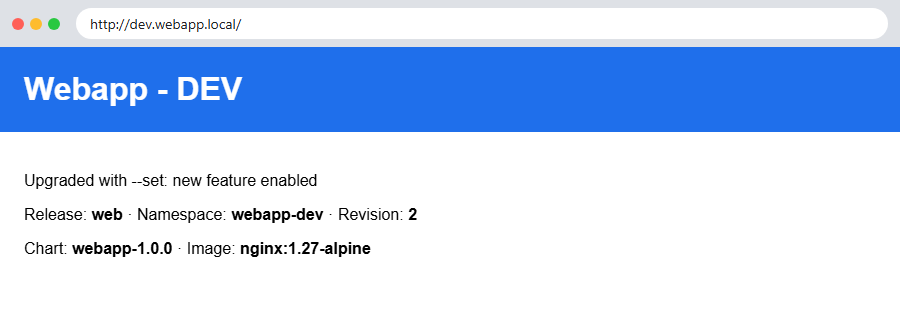
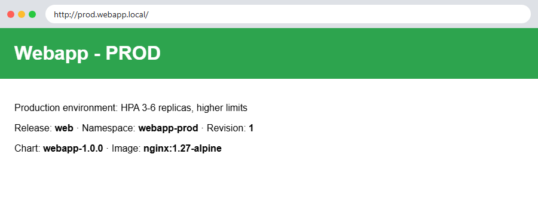

# Task 3: Helm Mini Project: One Chart, Two Environments

**Name:** Siddhant Singh · **Roll number:** 24BCS10153

> I couldn't access the course's Session 15 mini-project brief, so I built a chart from scratch that covers the session's deliverables: **Helm chart, values.yaml, templates, installation, upgrade and tests**, deployed to **dev** and **prod** from the same chart with different values. Rollback is shown in [Task 2](../README.md#task-2-helm-rollback-workflow).

## Chart structure

```text
03-mini-project/
├── webapp/                       # the chart
│   ├── Chart.yaml                # name, chart version 1.0.0, appVersion 1.27
│   ├── values.yaml               # defaults
│   └── templates/
│       ├── _helpers.tpl          # fullname + shared labels (named templates)
│       ├── configmap.yaml        # home page rendered from values (title, message, colour)
│       ├── deployment.yaml       # probes, resources, config checksum annotation
│       ├── service.yaml
│       ├── ingress.yaml          # only if ingress.enabled
│       ├── hpa.yaml              # only if autoscaling.enabled
│       ├── NOTES.txt             # post-install message
│       └── tests/test-page.yaml  # `helm test` hook
├── values-dev.yaml               # dev overrides
├── values-prod.yaml              # prod overrides
└── webapp-1.0.0.tgz              # packaged chart (helm package)
```

### Environment differences come only from values

| Setting | dev ([values-dev.yaml](values-dev.yaml)) | prod ([values-prod.yaml](values-prod.yaml)) |
| --- | --- | --- |
| Namespace | `webapp-dev` | `webapp-prod` |
| Replicas | 1 (fixed) | **HPA 3–6** at 60% CPU |
| Resources | 50m / 32Mi requests | 100m / 64Mi requests, higher limits |
| Ingress host | `dev.webapp.local` | `prod.webapp.local` |
| Page | blue "Webapp - DEV" | green "Webapp - PROD" |

### Template features used

- **Named templates** (`include "webapp.fullname"`, `webapp.labels`) so names and labels are consistent everywhere
- **Conditionals** (`{{- if .Values.ingress.enabled }}`), so dev gets no HPA and prod does
- **`toYaml` + `nindent`** to inject the `resources` block
- **Built-in objects**: `.Release.Name`, `.Release.Namespace` and `.Release.Revision` are rendered onto the page
- **`checksum/config` annotation**: a hash of the ConfigMap, so **changing only values triggers a rolling restart**
- **Test hook** (`helm.sh/hook: test`)

## Lint → Template → Package → Install → Test → Upgrade

```bash
$ find webapp -type f | sort
webapp/Chart.yaml
webapp/templates/NOTES.txt
webapp/templates/_helpers.tpl
webapp/templates/configmap.yaml
webapp/templates/deployment.yaml
webapp/templates/hpa.yaml
webapp/templates/ingress.yaml
webapp/templates/service.yaml
webapp/templates/tests/test-page.yaml
webapp/values.yaml
$ helm lint webapp -f values-dev.yaml
==> Linting webapp
[INFO] Chart.yaml: icon is recommended

1 chart(s) linted, 0 chart(s) failed
$ helm lint webapp -f values-prod.yaml
==> Linting webapp
[INFO] Chart.yaml: icon is recommended

1 chart(s) linted, 0 chart(s) failed
$ helm template web webapp -f values-dev.yaml | grep -E "^kind:" | sort | uniq -c
      1 kind: ConfigMap
      1 kind: Deployment
      1 kind: Ingress
      1 kind: Pod
      1 kind: Service
$ helm template web webapp -f values-prod.yaml | grep -E "^kind:" | sort | uniq -c
      1 kind: ConfigMap
      1 kind: Deployment
      1 kind: HorizontalPodAutoscaler
      1 kind: Ingress
      1 kind: Pod
      1 kind: Service
$ helm template web webapp -f values-prod.yaml --show-only templates/hpa.yaml
---
# Source: webapp/templates/hpa.yaml
apiVersion: autoscaling/v2
kind: HorizontalPodAutoscaler
metadata:
  name: web-webapp
  labels:
    app.kubernetes.io/name: webapp
    app.kubernetes.io/instance: web
    app.kubernetes.io/version: "1.27"
    app.kubernetes.io/managed-by: Helm
    helm.sh/chart: webapp-1.0.0
    environment: prod
spec:
  scaleTargetRef:
    apiVersion: apps/v1
    kind: Deployment
    name: web-webapp
  minReplicas: 3
  maxReplicas: 6
  metrics:
    - type: Resource
      resource:
        name: cpu
        target:
          type: Utilization
          averageUtilization: 60
$ helm package webapp
Successfully packaged chart and saved it to: C:\Users\singh\OneDrive\Desktop\DevOps Homework\session-15-helm\03-mini-project\webapp-1.0.0.tgz
$ helm install web ./webapp-1.0.0.tgz -f values-dev.yaml -n webapp-dev --create-namespace --wait
NAME: web
LAST DEPLOYED: Wed Oct  7 21:41:43 2026
NAMESPACE: webapp-dev
STATUS: deployed
REVISION: 1
DESCRIPTION: Install complete
NOTES:
Webapp - DEV has been deployed!

  Release:     web (revision 1)
  Namespace:   webapp-dev
  Environment: dev
  URL:         http://dev.webapp.local/
  Replicas:    1
$ helm install web ./webapp-1.0.0.tgz -f values-prod.yaml -n webapp-prod --create-namespace --wait
NAME: web
LAST DEPLOYED: Wed Oct  7 21:41:46 2026
NAMESPACE: webapp-prod
STATUS: deployed
REVISION: 1
DESCRIPTION: Install complete
NOTES:
Webapp - PROD has been deployed!

  Release:     web (revision 1)
  Namespace:   webapp-prod
  Environment: prod
  URL:         http://prod.webapp.local/
  Autoscaling: 3-6 replicas at 60% CPU
$ helm list -A
NAME	NAMESPACE  	REVISION	UPDATED                              	STATUS  	CHART       	APP VERSION
web 	webapp-dev 	1       	2026-10-07 21:41:43.3000331 +0530 IST	deployed	webapp-1.0.0	1.27       
web 	webapp-prod	1       	2026-10-07 21:41:46.5410911 +0530 IST	deployed	webapp-1.0.0	1.27       
$ kubectl get deploy,svc,ingress,hpa -n webapp-dev
NAME                         READY   UP-TO-DATE   AVAILABLE   AGE
deployment.apps/web-webapp   1/1     1            1           10s

NAME                 TYPE        CLUSTER-IP       EXTERNAL-IP   PORT(S)   AGE
service/web-webapp   ClusterIP   10.103.185.138   <none>        80/TCP    10s

NAME                                   CLASS   HOSTS              ADDRESS   PORTS   AGE
ingress.networking.k8s.io/web-webapp   nginx   dev.webapp.local             80      10s
$ kubectl get deploy,svc,ingress,hpa -n webapp-prod
NAME                         READY   UP-TO-DATE   AVAILABLE   AGE
deployment.apps/web-webapp   3/3     3            3           6s

NAME                 TYPE        CLUSTER-IP      EXTERNAL-IP   PORT(S)   AGE
service/web-webapp   ClusterIP   10.103.100.35   <none>        80/TCP    6s

NAME                                   CLASS   HOSTS               ADDRESS   PORTS   AGE
ingress.networking.k8s.io/web-webapp   nginx   prod.webapp.local             80      6s

NAME                                             REFERENCE               TARGETS              MINPODS   MAXPODS   REPLICAS   AGE
horizontalpodautoscaler.autoscaling/web-webapp   Deployment/web-webapp   cpu: <unknown>/60%   3         6         1          6s
$ curl -s -H "Host: dev.webapp.local" http://127.0.0.1/ | grep -E "<h1|<p>"
    <h1 style="margin:0">Webapp - DEV</h1>
    <p>Development environment: 1 replica, no autoscaling</p>
    <p>Release: <b>web</b> &middot; Namespace: <b>webapp-dev</b> &middot; Revision: <b>1</b></p>
    <p>Chart: <b>webapp-1.0.0</b> &middot; Image: <b>nginx:1.27-alpine</b></p>
$ curl -s -H "Host: prod.webapp.local" http://127.0.0.1/ | grep -E "<h1|<p>"
    <h1 style="margin:0">Webapp - PROD</h1>
    <p>Production environment: HPA 3-6 replicas, higher limits</p>
    <p>Release: <b>web</b> &middot; Namespace: <b>webapp-prod</b> &middot; Revision: <b>1</b></p>
    <p>Chart: <b>webapp-1.0.0</b> &middot; Image: <b>nginx:1.27-alpine</b></p>
$ helm test web -n webapp-dev
NAME: web
LAST DEPLOYED: Wed Oct  7 21:41:43 2026
NAMESPACE: webapp-dev
STATUS: deployed
REVISION: 1
DESCRIPTION: Install complete
TEST SUITE:     web-webapp-test
Last Started:   Wed Oct  7 21:42:03 2026
Last Completed: Wed Oct  7 21:42:06 2026
Phase:          Succeeded
$ helm test web -n webapp-prod
NAME: web
LAST DEPLOYED: Wed Oct  7 21:41:46 2026
NAMESPACE: webapp-prod
STATUS: deployed
REVISION: 1
DESCRIPTION: Install complete
TEST SUITE:     web-webapp-test
Last Started:   Wed Oct  7 21:42:06 2026
Last Completed: Wed Oct  7 21:42:09 2026
Phase:          Succeeded
$ helm upgrade web ./webapp-1.0.0.tgz -n webapp-dev -f values-dev.yaml --set page.message="Upgraded with --set: new feature enabled" --wait
Release "web" has been upgraded. Happy Helming!
NAME: web
LAST DEPLOYED: Wed Oct  7 21:42:09 2026
NAMESPACE: webapp-dev
STATUS: deployed
REVISION: 2
DESCRIPTION: Upgrade complete
NOTES:
Webapp - DEV has been deployed!

  Release:     web (revision 2)
  Namespace:   webapp-dev
  Environment: dev
  URL:         http://dev.webapp.local/
  Replicas:    1
$ kubectl get pods -n webapp-dev
NAME                          READY   STATUS        RESTARTS   AGE
web-webapp-78865b8b6c-hznxb   1/1     Running       0          1s
web-webapp-8c7767cfd-zxl8w    1/1     Terminating   0          28s
$ curl -s -H "Host: dev.webapp.local" http://127.0.0.1/ | grep -E "<h1|<p>"
    <h1 style="margin:0">Webapp - DEV</h1>
    <p>Upgraded with --set: new feature enabled</p>
    <p>Release: <b>web</b> &middot; Namespace: <b>webapp-dev</b> &middot; Revision: <b>2</b></p>
    <p>Chart: <b>webapp-1.0.0</b> &middot; Image: <b>nginx:1.27-alpine</b></p>
$ helm history web -n webapp-dev
REVISION	UPDATED                 	STATUS    	CHART       	APP VERSION	DESCRIPTION     
1       	Wed Oct  7 21:41:43 2026	superseded	webapp-1.0.0	1.27       	Install complete
2       	Wed Oct  7 21:42:09 2026	deployed  	webapp-1.0.0	1.27       	Upgrade complete
$ helm get values web -n webapp-dev
USER-SUPPLIED VALUES:
environment: dev
ingress:
  enabled: true
  host: dev.webapp.local
page:
  color: '#1f6feb'
  message: 'Upgraded with --set: new feature enabled'
  title: Webapp - DEV
replicaCount: 1
```

## Result: same chart, two environments

| dev: `http://dev.webapp.local/` (after upgrade, revision 2) | prod: `http://prod.webapp.local/` |
| --- | --- |
|  |  |

### What I verified

- `helm lint` passes for both value sets. `helm template` shows prod renders an extra **HorizontalPodAutoscaler** and dev does not.
- `helm package` produced `webapp-1.0.0.tgz`, and both releases were installed **from the package** into separate namespaces (`--create-namespace`).
- `helm list -A` shows the **same release name `web`** in two namespaces, with different config.
- Through the Ingress, each host serves its own page, with the release, namespace and revision rendered by Helm.
- `helm test` **Succeeded** for both environments.
- `helm upgrade --set page.message=...` changed only a value. The `checksum/config` annotation changed, so the Deployment **rolled a new Pod automatically**, and the page shows the new message and **Revision 2**.
