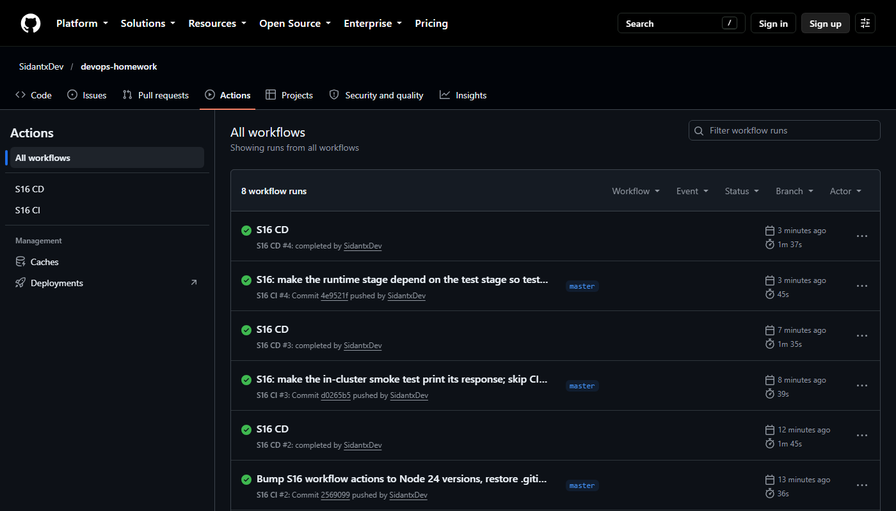
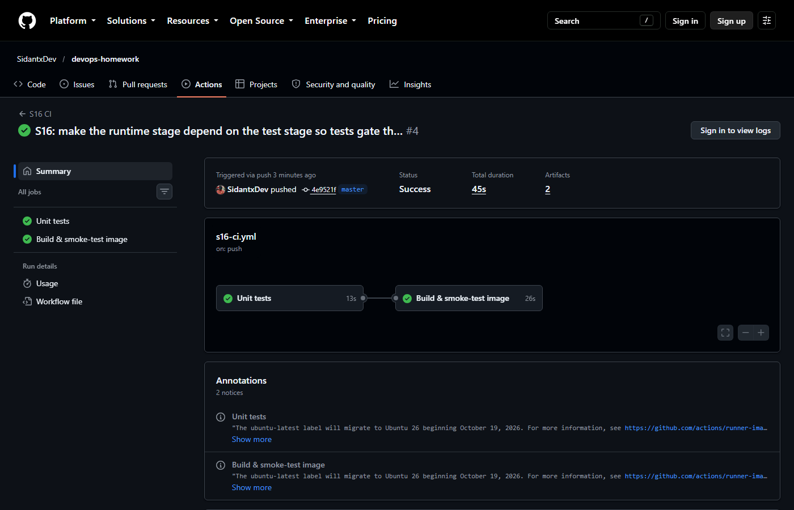
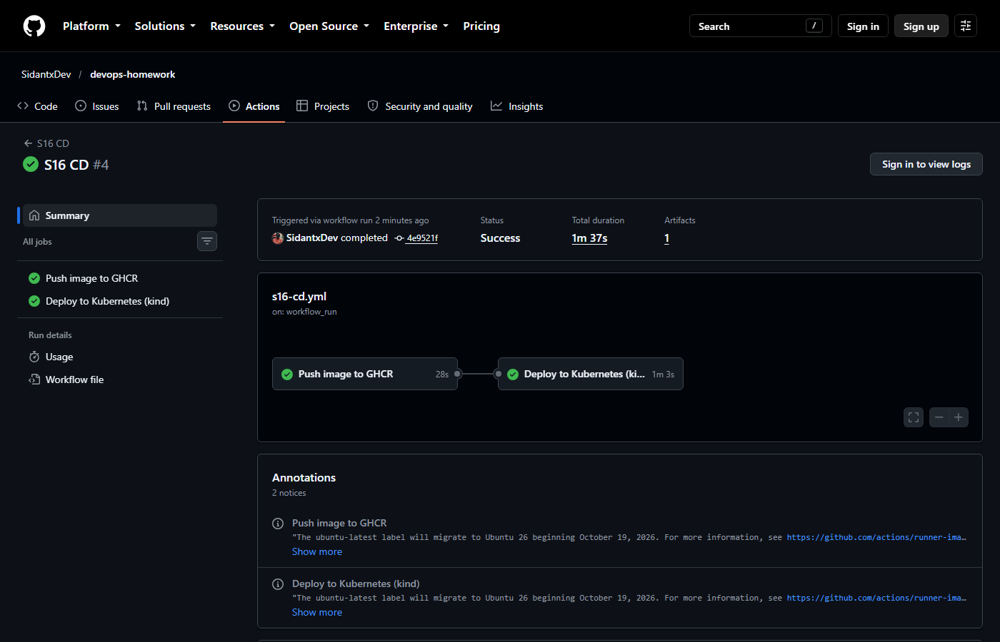

# Session 16: CI/CD & GitHub Actions

**Name:** Siddhant Singh
**Roll number:** 24BCS10153

A complete, **working** CI/CD demo project. Every push to `master` that touches this folder is tested, built, packaged, published to a container registry and deployed to Kubernetes automatically by **GitHub Actions**.

```text
 git push ──► S16 CI ───────────────────────────────┐  (workflow_run: only if CI succeeded)
              ├─ job: Unit tests      (npm test, test report artifact)
              └─ job: Build & smoke-test (docker build → run → curl, image artifact)
                                                    ▼
              S16 CD ───────────────────────────────────────────────
              ├─ job: Push image to GHCR (ghcr.io/sidantxdev/s16-cicd-demo:<sha>, :latest)
              └─ job: Deploy to Kubernetes (kind cluster → kubectl apply → rollout → smoke test)
```

## Deliverables

| Deliverable | File |
| --- | --- |
| Application source code | [app/src/app.js](app/src/app.js), [app/src/server.js](app/src/server.js): a small Node.js REST API (`/`, `/health`, `/add`) with no external dependencies |
| Unit tests | [app/test/app.test.js](app/test/app.test.js): 8 tests using Node's built-in test runner |
| Dockerfile | [Dockerfile](Dockerfile): multi-stage, the **test stage must pass** before the runtime image is built, and it runs as non-root with a `HEALTHCHECK` |
| Kubernetes manifest | [k8s/deployment.yaml](k8s/deployment.yaml): 2 replicas, readiness probe, resources, Service |
| CI pipeline | [.github/workflows/s16-ci.yml](../.github/workflows/s16-ci.yml) |
| CD pipeline | [.github/workflows/s16-cd.yml](../.github/workflows/s16-cd.yml) |
| Successful pipeline runs | [CI run #37654134307](https://github.com/SidantxDev/devops-homework/actions/runs/37654134307) · [CD run #37654234211](https://github.com/SidantxDev/devops-homework/actions/runs/37654234211) |

---

## Concepts

| Concept | Meaning | In this project |
| --- | --- | --- |
| **CI (Continuous Integration)** | Every change is automatically **built and tested** so problems are caught early | `S16 CI` runs on every push and PR |
| **CD (Continuous Delivery/Deployment)** | Every change that passes CI is automatically **released** (delivery means ready to deploy, deployment means actually deployed) | `S16 CD` publishes the image and deploys it |
| **CI/CD pipeline** | The automated chain code → build → test → package → release → deploy | CI → (workflow_run) → CD |
| **GitHub Actions** | GitHub's built-in automation platform | Both pipelines |
| **Workflow** | A YAML file in `.github/workflows/` describing **when** (`on:`) and **what** to run | `s16-ci.yml`, `s16-cd.yml` |
| **Trigger (`on:`)** | The event that starts a workflow | CI: `push` and `pull_request` with **path filters** (docs-only changes are skipped) and `workflow_dispatch`. CD: `workflow_run` of CI on `master` |
| **Job** | A group of steps that runs on **one runner**. Jobs run in parallel unless linked with `needs:` | CI: `test` → `build`. CD: `publish` → `deploy` |
| **Step** | One command (`run:`) or one reusable action (`uses:`) inside a job | `actions/checkout`, `npm test`, `docker build`, … |
| **Runner** | The machine that executes a job. GitHub-hosted `ubuntu-latest` is a fresh VM every time | All 4 jobs |
| **Secrets** | Encrypted values that are injected at runtime and **masked** in logs (shown as `***`) | `secrets.GITHUB_TOKEN` logs in to GHCR. The job's `permissions: packages: write` limits what it can do |
| **Artifacts** | Files a job uploads so later jobs or people can download them | `test-results` (JUnit XML) and `docker-image` (image tar) |
| **Environment** | A named deployment target (can require approvals) | The `deploy` job uses `environment: staging` |
| **Build** | Turn source into a runnable artifact | `docker build` (multi-stage) |
| **Test** | Prove it works automatically | Unit tests, a container smoke test, and an in-cluster smoke test |

---

## Pipeline execution: real output from GitHub Actions

### All runs



### CI: job "Unit tests"



```bash
$ npm test
> s16-cicd-demo@1.0.0 test
> node --test --test-reporter=spec --test-reporter-destination=stdout --test-reporter=junit --test-reporter-destination=test-results.xml
✔ add() sums two numbers (0.427267ms)
✔ add() rejects non-numbers (0.226418ms)
✔ greet() uses the name or a default (0.073169ms)
▶ HTTP endpoints
  ✔ GET /health returns ok (30.657245ms)
  ✔ GET /add?a=2&b=40 returns 42 (2.703816ms)
  ✔ GET /add with bad input returns 400 (1.687239ms)
  ✔ unknown path returns 404 (1.418578ms)
✔ HTTP endpoints (39.028865ms)
ℹ tests 8
ℹ suites 0
ℹ pass 8
ℹ fail 0
ℹ cancelled 0
ℹ skipped 0
ℹ todo 0
ℹ duration_ms 117.472189
```

### CI: job "Build & smoke-test image"

```bash
$ docker build --build-arg APP_VERSION=${GITHUB_SHA::7} -t $IMAGE_NAME:${GITHUB_SHA::7} $APP_DIR
#6 [test 1/6] FROM docker.io/library/node:22-alpine@sha256:0a7108bf6c7bf5de370ffb1a3ed6be93d405b43ff159f681a8d18c0e2bc2e402
#7 [test 2/6] WORKDIR /app
#8 [test 3/6] COPY app/package.json ./
#9 [test 4/6] COPY app/src ./src
#10 [test 5/6] COPY app/test ./test
#11 [test 6/6] RUN npm test
#11 0.637 ℹ tests 8
#11 0.637 ℹ pass 8
#11 0.637 ℹ fail 0
#12 [runtime 3/4] COPY --from=test /app/package.json ./
#13 [runtime 4/4] COPY --from=test /app/src ./src
#14 naming to docker.io/library/s16-cicd-demo:4e9521f done
REPOSITORY      TAG       IMAGE ID       CREATED        SIZE
s16-cicd-demo   4e9521f   a91ba998a637   1 second ago   167MB
$ docker run -d --name smoke -p 3000:3000 ... && curl /health, /?name=CI, /add
1bb46db7022f8516ebae394198c2ef629c0463e29ddb1e99f8097f7345fc5e85
{"status":"ok"}
{"message":"Hello, CI!","version":"4e9521f"}
```

The image build **runs the unit tests again inside the test stage** (`[test 6/6] RUN npm test`, 8 passed). If any test failed, the image could not be built. The built container then answers `/health` and `/` inside the runner.

> While building this I found that BuildKit **skips stages that the final image does not depend on**, so my first Dockerfile never actually ran the test stage. Making the runtime stage `COPY --from=test` fixed it, and the log above now shows `[test 6/6] RUN npm test`.

### CD: job "Push image to GHCR"



```bash
$ docker/build-push-action (push: true)
#14 naming to ghcr.io/sidantxdev/s16-cicd-demo:4e9521f done
#14 naming to ghcr.io/sidantxdev/s16-cicd-demo:latest done
#16 pushing ghcr.io/sidantxdev/s16-cicd-demo:4e9521f with docker
#17 pushing ghcr.io/sidantxdev/s16-cicd-demo:latest with docker
  "image.name": "ghcr.io/sidantxdev/s16-cicd-demo:4e9521f,ghcr.io/sidantxdev/s16-cicd-demo:latest"
```

### CD: job "Deploy to Kubernetes (kind)"

```bash
$ docker pull <image> && kind load docker-image <image> --name staging
Digest: sha256:033738d0d29132798ee4c4378c29c66f17f7a97ad73fa2abf4ae34369dcec669
Status: Downloaded newer image for ghcr.io/sidantxdev/s16-cicd-demo:4e9521f
Image: "ghcr.io/sidantxdev/s16-cicd-demo:4e9521f" with ID "sha256:6be0c7039be32ed79f264b646bd7367d29ce461a2cba4ecf05ef4ace169717f7" not yet present on node "staging-control-plane", loading...
$ kubectl apply -f k8s/deployment.yaml && kubectl rollout status deployment/s16-cicd-demo
deployment.apps/s16-cicd-demo created
service/s16-cicd-demo created
Waiting for deployment "s16-cicd-demo" rollout to finish: 0 of 2 updated replicas are available...
Waiting for deployment "s16-cicd-demo" rollout to finish: 1 of 2 updated replicas are available...
deployment "s16-cicd-demo" successfully rolled out
NAME                             READY   STATUS    RESTARTS   AGE   IP           NODE                    NOMINATED NODE   READINESS GATES
s16-cicd-demo-5f89db449b-nlk49   1/1     Running   0          2s    10.244.0.5   staging-control-plane   <none>           <none>
s16-cicd-demo-5f89db449b-slpj6   1/1     Running   0          2s    10.244.0.6   staging-control-plane   <none>           <none>
$ kubectl run smoke --image=curlimages/curl -- curl -fs http://s16-cicd-demo/?name=Kubernetes && kubectl logs smoke
pod/smoke created
pod/smoke condition met
{"message":"Hello, Kubernetes!","version":"4e9521f"}
```

The image that CI tested (`4e9521f`, the commit SHA) was pushed to **GHCR**, pulled back, deployed to a fresh Kubernetes cluster as 2 replicas, and answered `Hello, Kubernetes!` with the matching version.

## Run it locally

```bash
cd session-16-cicd-github-actions/app && npm test
cd .. && docker build -t s16-cicd-demo . && docker run -p 3000:3000 s16-cicd-demo
curl "localhost:3000/?name=Siddhant"        # {"message":"Hello, Siddhant!","version":"dev"}
```
